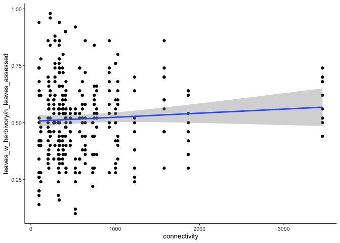
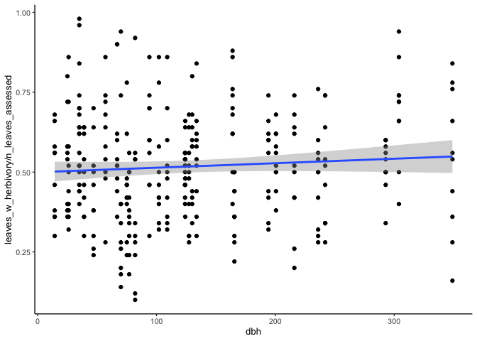
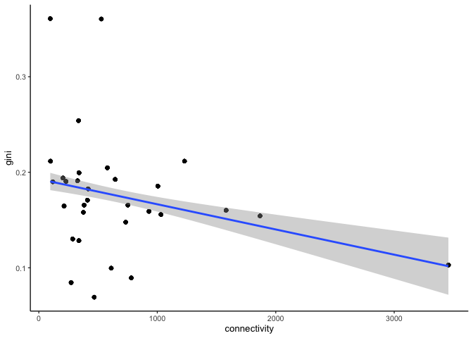

Exploring the herbivory data
================
eleanorjackson
11 April, 2023

``` r
library("tidyverse")
library("here")
```

``` r
readRDS(here::here("data", "clean", "connectivity_data.rds")) -> connectivity

read_csv(here::here("data", "raw", "hawthorn_herbivory.csv")) -> herbivory
```

    ## Rows: 956 Columns: 14
    ## ── Column specification ────────────────────────────────────────────────────────
    ## Delimiter: ","
    ## chr  (1): sample
    ## dbl (12): tree_id, date, n_leaves_assessed, leaves_w_herbivory, little_green...
    ## lgl  (1): rust_presence
    ## 
    ## ℹ Use `spec()` to retrieve the full column specification for this data.
    ## ℹ Specify the column types or set `show_col_types = FALSE` to quiet this message.

``` r
herbivory %>%
  dplyr::filter(!grepl("S", sample)) %>%
  mutate(focal_tree = as.integer(tree_id)) %>%
  select(tree_id, focal_tree, sample, date,
         n_leaves_assessed, leaves_w_herbivory) %>%
  inner_join(connectivity, by = c("focal_tree" = "plot")) -> clean

readRDS(here::here("data", "clean", "hawthorn_plots.rds")) %>%
  filter(tree_id == "tree_0") %>%
  mutate(plot = as.numeric(plot)) %>%
  select(plot, dbh) %>%
  left_join(clean, by = c("plot" = "focal_tree"),
             multiple = "all") %>% 
  mutate(is_focal = case_when( floor(tree_id) == tree_id ~ TRUE,
                               .default = FALSE)) -> clean_dbh
```

``` r
ggplot(filter(clean_dbh, is_focal == TRUE), aes(y = leaves_w_herbivory/n_leaves_assessed, x = connectivity)) +
  geom_point() +
  geom_smooth(method = "lm")
```

    ## `geom_smooth()` using formula = 'y ~ x'

<!-- -->

``` r
ggplot(filter(clean_dbh, is_focal == TRUE), aes(y = leaves_w_herbivory/n_leaves_assessed, x = dbh)) +
  geom_point() +
  geom_smooth(method = "lm")
```

    ## `geom_smooth()` using formula = 'y ~ x'

<!-- -->

``` r
clean_dbh %>%
  mutate(connectivity_sc = scale(connectivity),
         dbh_sc = scale(dbh),
         focal_tree = as.factor(tree_id)
  ) -> clean_dbh_sc

lme4::glmer(formula = cbind(leaves_w_herbivory, (n_leaves_assessed - leaves_w_herbivory)) ~ 
     connectivity_sc + dbh_sc + (1|tree_id), 
   data = filter(clean_dbh_sc, is_focal == TRUE), 
   family = binomial(link = "logit")) -> mod

summary(mod)
```

    ## Generalized linear mixed model fit by maximum likelihood (Laplace
    ##   Approximation) [glmerMod]
    ##  Family: binomial  ( logit )
    ## Formula: cbind(leaves_w_herbivory, (n_leaves_assessed - leaves_w_herbivory)) ~  
    ##     connectivity_sc + dbh_sc + (1 | tree_id)
    ##    Data: filter(clean_dbh_sc, is_focal == TRUE)
    ## 
    ##      AIC      BIC   logLik deviance df.resid 
    ##   2964.4   2979.4  -1478.2   2956.4      306 
    ## 
    ## Scaled residuals: 
    ##     Min      1Q  Median      3Q     Max 
    ## -5.3799 -1.5509  0.0114  1.2287  7.8523 
    ## 
    ## Random effects:
    ##  Groups  Name        Variance Std.Dev.
    ##  tree_id (Intercept) 0.08932  0.2989  
    ## Number of obs: 310, groups:  tree_id, 31
    ## 
    ## Fixed effects:
    ##                 Estimate Std. Error z value Pr(>|z|)
    ## (Intercept)      0.07256    0.05609   1.294    0.196
    ## connectivity_sc  0.06527    0.05820   1.121    0.262
    ## dbh_sc           0.06901    0.05838   1.182    0.237
    ## 
    ## Correlation of Fixed Effects:
    ##             (Intr) cnnct_
    ## cnnctvty_sc 0.001        
    ## dbh_sc      0.003  0.263

No trend here but looks like there is a lot of variability within a
single tree.

## Variability in herbivory

Function to calculate the gini index:

``` r
get_gini <- function(x, n = rep(1, length(x)) ) {
  x <- rep(x, n)
  n <- length(x)
  x <- sort(x)
  res <- 2 * sum(x * 1:n) / (n*sum(x)) - 1 - (1/n)
  res <- n / (n - 1) * res

  return(res)

}
```

Within tree variability

``` r
clean_dbh_sc %>%
  filter(is_focal == TRUE) %>% 
  group_by(tree_id) %>%
  mutate(gini = get_gini(x = leaves_w_herbivory/n_leaves_assessed)) -> gini_data

gini_data %>% 
  ggplot(aes(y = gini, x = connectivity)) +
  geom_point() +
  geom_smooth(method = "lm")
```

    ## `geom_smooth()` using formula = 'y ~ x'

<!-- -->

``` r
lm(gini ~ scale(connectivity), data = gini_data) -> gini_mod

summary(gini_mod)
```

    ## 
    ## Call:
    ## lm(formula = gini ~ scale(connectivity), data = gini_data)
    ## 
    ## Residuals:
    ##       Min        1Q    Median        3Q       Max 
    ## -0.111314 -0.024878  0.000757  0.016614  0.181452 
    ## 
    ## Coefficients:
    ##                      Estimate Std. Error t value Pr(>|t|)    
    ## (Intercept)          0.175310   0.003484  50.315  < 2e-16 ***
    ## scale(connectivity) -0.017363   0.003490  -4.975 1.08e-06 ***
    ## ---
    ## Signif. codes:  0 '***' 0.001 '**' 0.01 '*' 0.05 '.' 0.1 ' ' 1
    ## 
    ## Residual standard error: 0.06135 on 308 degrees of freedom
    ## Multiple R-squared:  0.07439,    Adjusted R-squared:  0.07139 
    ## F-statistic: 24.75 on 1 and 308 DF,  p-value: 1.085e-06

More connected trees have less variability in herbivory within a single
tree. More connectivity -\> more herbivory events -\> low variability in
herbivory

Note that in this analysis I have only used focal trees, but we also
have data for nearest neighbours and saplings. To add these trees to the
analysis I’d need to calculate connectivity for these trees
independently and do some edge effect mitigation.
