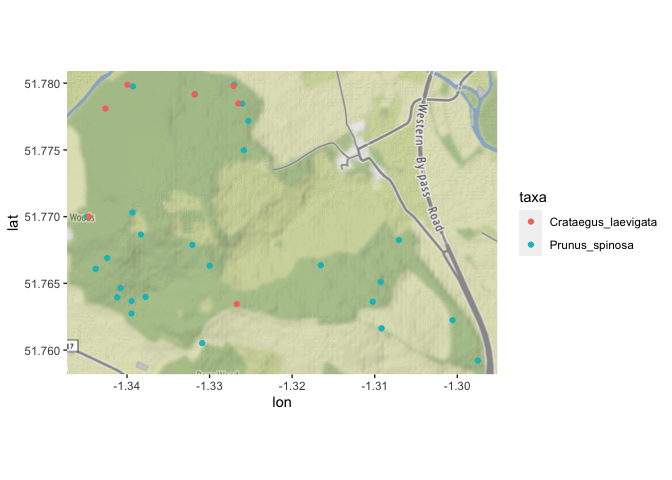
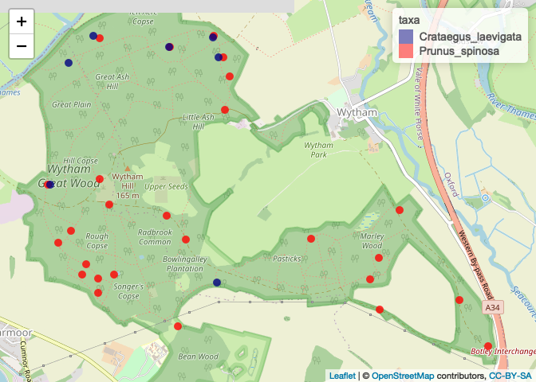

Make an interactive map of focal trees
================
Eleanor Jackson
01 June, 2021

``` r
library("tidyverse")
```

    ## ── Attaching packages ─────────────────────────────────────── tidyverse 1.3.1 ──

    ## ✓ ggplot2 3.3.3     ✓ purrr   0.3.4
    ## ✓ tibble  3.1.2     ✓ dplyr   1.0.6
    ## ✓ tidyr   1.1.3     ✓ stringr 1.4.0
    ## ✓ readr   1.4.0     ✓ forcats 0.5.1

    ## ── Conflicts ────────────────────────────────────────── tidyverse_conflicts() ──
    ## x dplyr::filter() masks stats::filter()
    ## x dplyr::lag()    masks stats::lag()

``` r
library("sp")
library("ggmap")
```

    ## Google's Terms of Service: https://cloud.google.com/maps-platform/terms/.

    ## Please cite ggmap if you use it! See citation("ggmap") for details.

``` r
library("geojsonio")
```

    ## Registered S3 method overwritten by 'geojsonsf':
    ##   method        from   
    ##   print.geojson geojson

    ## 
    ## Attaching package: 'geojsonio'

    ## The following object is masked from 'package:base':
    ## 
    ##     pretty

``` r
library("leaflet")
```

## Read in gpx file and clean up

``` r
plotKML::readGPX(here::here("data", "raw", "waypoints.gpx")) %>%
  map_df(~.) %>%
  rename(id = name) %>%
  mutate(taxa = case_when(sym == "Park" ~ "Prunus_spinosa",
                          sym == "Flag, Blue" ~ "Crataegus_laevigata")) -> waypoints
```

## Make a static map

``` r
bbox <- make_bbox(c(min(waypoints$lon), max(waypoints$lon)), 
                  c(min(waypoints$lat), max(waypoints$lat)))

ggmap(get_map(bbox, source = "osm", messaging = FALSE)) +
  geom_point(data = waypoints, 
           aes(lon, lat, colour = taxa))
```

    ## Source : http://tile.stamen.com/terrain/14/8130/5428.png

    ## Source : http://tile.stamen.com/terrain/14/8131/5428.png

    ## Source : http://tile.stamen.com/terrain/14/8132/5428.png

    ## Source : http://tile.stamen.com/terrain/14/8133/5428.png

    ## Source : http://tile.stamen.com/terrain/14/8130/5429.png

    ## Source : http://tile.stamen.com/terrain/14/8131/5429.png

    ## Source : http://tile.stamen.com/terrain/14/8132/5429.png

    ## Source : http://tile.stamen.com/terrain/14/8133/5429.png

<!-- -->

``` r
# not very detailed
```

``` r
# make the data a spatial df object 
SpatialPointsDataFrame(coords = select(waypoints, lon, lat), 
                       data = waypoints, 
                       proj4string = CRS("+init=epsg:4326")) -> waypoints_sp
```

## Make an interactive map

``` r
# colours
pal <- colorFactor(c("navy", "red"), c("Prunus_spinosa", "Crataegus_laevigata"))

# make a map with leaflet
leaflet(data = waypoints_sp)%>% 
  addCircleMarkers(label = ~id, color = ~pal(taxa), 
                            fillOpacity = 0.8, stroke = FALSE, radius = 5) %>% 
  addTiles() %>%
  addLegend(pal = pal, values = ~taxa)
```

<!-- -->

``` r
# export as geojson
waypoints_geojson <- geojson_json(waypoints_sp)
geojson_write(waypoints_geojson, file = "focal-trees-map.geojson")
```

    ## Success! File is at focal-trees-map.geojson

    ## <geojson-file>
    ##   Path:       focal-trees-map.geojson
    ##   From class: json

<script src="https://embed.github.com/view/geojson/ee-jackson/wytham-seed-predation/main/code/exploration/focal-trees-map.geojson"></script>
