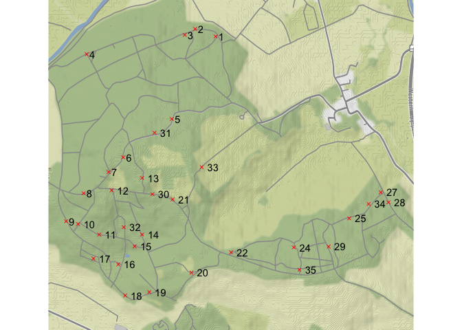
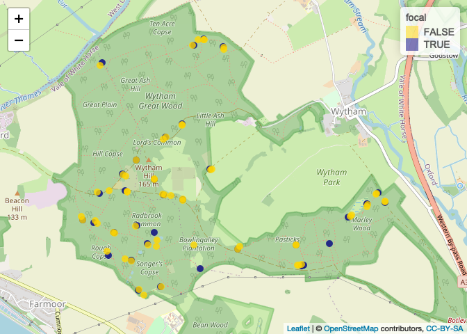

Make a map of focal trees
================
Eleanor Jackson
02 June, 2021

``` r
library("tidyverse")
library("sp")
library("ggmap")
library("geojsonio")
library("leaflet")
```

## Read in gpx file and clean up

This file has come straight from the garmin gps

``` r
plotKML::readGPX(here::here("data", "raw", "waypoints.gpx")) %>%
  map_df(~.) %>%
  rename(id = name) %>%
  mutate(taxa = case_when(sym == "Park" ~ "Prunus_spinosa",
                          sym == "Flag, Blue" ~ "Crataegus_laevigata")) %>%
  select(-sym) -> waypoints
```

## Make a static map

``` r
bbox <- make_bbox(c(min(waypoints$lon), max(waypoints$lon)), 
                  c(min(waypoints$lat), max(waypoints$lat)))

get_map(bbox, source = "stamen", force=TRUE) %>%
  ggmap() +
  geom_point(data = waypoints, 
           aes(lon, lat, colour = taxa))
```

<!-- -->

It’s not very detailed - we can’t see any of the trails

## Make an interactive map

### make the data a SpatialPointsDataFrame object

``` r
SpatialPointsDataFrame(coords = select(waypoints, lon, lat), 
                       data = waypoints, 
                       proj4string = CRS("+init=epsg:4326")) -> waypoints_sp
```

### make a map with leaflet

This is interactive in RStudio and if we knit to html, but GitHub won’t
render it.

``` r
# colours
pal <- colorFactor(c("navy", "red"), c("Prunus_spinosa", "Crataegus_laevigata"))

leaflet(data = waypoints_sp)%>% 
  addCircleMarkers(label = ~id, color = ~pal(taxa), 
                            fillOpacity = 0.8, stroke = FALSE, radius = 5) %>% 
  addTiles() %>%
  addLegend(pal = pal, values = ~taxa)
```

<!-- -->

### make a geoJSON file

We can export the SpatialPointsDataFrame to a geoJSON, which GitHub will
render as an interactive map, annotated with our geodata (taxa, id).
This gives us a browsable, online version we can refer to.

``` r
# convert to geojson
waypoints_geojson <- geojson_json(waypoints_sp)

# write
geojson_write(waypoints_geojson, file = "figures/2021-05-28_create-map/focal-trees-map.geojson")
```

    ## Success! File is at figures/2021-05-28_create-map/focal-trees-map.geojson

    ## <geojson-file>
    ##   Path:       figures/2021-05-28_create-map/focal-trees-map.geojson
    ##   From class: json

[**View map
here!**](figures/2021-05-28_create-map/focal-trees-map.geojson)
