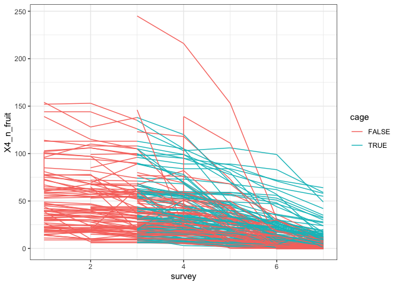
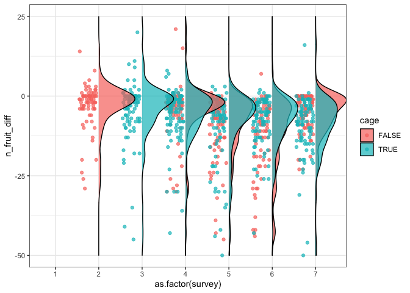

Have most fruits dropped?
================
Eleanor Jackson
31 January, 2022

I want to quickly see if fruit drop has levelled off. Can we stop
counting fruits now?

``` r
library("tidyverse")
library("lubridate")
library("stringr")
library("ggridges")
```

``` r
fruit_counts <- read.csv(here::here("data", "raw", "form-1__fruit-counts.csv"))

fruit_counts %>%
  mutate(date = as_date(X1_date), branch = str_sub(X3_branch_id,-1)) %>%
  mutate(cage = ifelse(branch == "d" | branch == "e" | branch == "f", FALSE, TRUE)) %>%
  mutate(survey = case_when(
    X1_date == "2022/01/28" |X1_date == "2022/01/27" ~ 7,
    X1_date == "2021/12/21" |X1_date == "2021/12/20" ~ 6,
    X1_date == "2021/11/25" |X1_date == "2021/11/24" ~ 5,
    X1_date == "2021/10/29" |X1_date == "2021/10/28" ~ 4,
    X1_date == "2021/09/29" |X1_date == "2021/09/28" |X1_date == "2021/09/27" ~ 3,
    X1_date == "2021/09/02" ~ 2,
    X1_date == "2021/08/06" |X1_date == "2021/08/05" ~ 1,
  )) %>%
  group_by(X3_branch_id) %>%
  mutate(n_fruit_diff = X4_n_fruit - lag(X4_n_fruit, order_by = date)) %>%
  mutate(cage = ifelse(survey == 1 | survey == 2 & cage == TRUE, FALSE, cage)) %>%
  ggplot(aes(y = X4_n_fruit, x = survey, group = X3_branch_id, colour = cage)) +
  geom_line() +
  theme(legend.position = "none") +
  theme_bw()
```

<!-- -->

Hmm that’s quite hard to read. Can also see some erroneous data points
in there where the number of fruits on a branch increases from one time
point to the next!

Let’s try looking at the difference in n\_fruit from one time point to
the next. If fruit drop is levelling off we should see the diff moving
towards zero.

``` r
fruit_counts %>%
  mutate(date = as_date(X1_date), branch = str_sub(X3_branch_id,-1)) %>%
  mutate(cage = ifelse(branch == "d" | branch == "e" | branch == "f", FALSE, TRUE)) %>%
  mutate(survey = case_when(
    X1_date == "2022/01/28" |X1_date == "2022/01/27" ~ 7,
    X1_date == "2021/12/21" |X1_date == "2021/12/20" ~ 6,
    X1_date == "2021/11/25" |X1_date == "2021/11/24" ~ 5,
    X1_date == "2021/10/29" |X1_date == "2021/10/28" ~ 4,
    X1_date == "2021/09/29" |X1_date == "2021/09/28" |X1_date == "2021/09/27" ~ 3,
    X1_date == "2021/09/02" ~ 2,
    X1_date == "2021/08/06" |X1_date == "2021/08/05" ~ 1,
  )) %>%
  group_by(X3_branch_id) %>%
  mutate(n_fruit_diff = X4_n_fruit - lag(X4_n_fruit, order_by = date)) %>%
  mutate(cage = ifelse(survey == 1 | survey == 2 & cage == TRUE, FALSE, cage)) %>%
  ggplot(aes(x = n_fruit_diff, y = as.factor(survey), fill = cage)) +
  geom_density_ridges(
    aes(point_color = cage, point_fill = cage),
    jittered_points = TRUE, position = "raincloud",
    alpha = 0.7, scale = 0.9) +
  coord_flip() +
  theme_bw() +
  xlim(-50,25)
```

    ## Picking joint bandwidth of 2.31

    ## Warning: Removed 218 rows containing non-finite values (stat_density_ridges).

<!-- -->

This is cool, can see that most fruits were lost in Nov and Dec, Jan is
starting to have more points at zero - narrower distribution, but it
looks like we could do with another round of counts in Feb.
