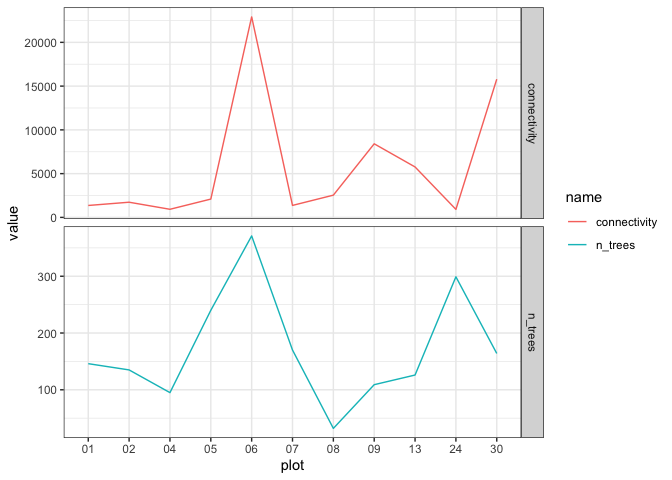
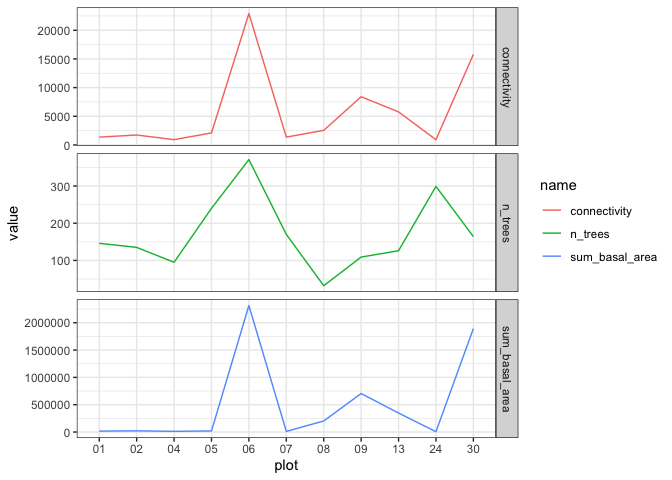

First look at mapping data; cleaning and connectivity
================
Eleanor Jackson
26 July, 2022

We want to conduct herbivory surveys on individuals at high and low
conspecific densities. To identify them we’ll need a measure of
connectivity. I’m going to take a first look at the mapping data that
has been collected so far and have a go at calculating connectivity for
all of the trees.

``` r
library("tidyverse")
```

    ## ── Attaching packages ─────────────────────────────────────── tidyverse 1.3.1 ──

    ## ✓ ggplot2 3.3.5     ✓ purrr   0.3.4
    ## ✓ tibble  3.1.6     ✓ dplyr   1.0.8
    ## ✓ tidyr   1.2.0     ✓ stringr 1.4.0
    ## ✓ readr   2.0.2     ✓ forcats 0.5.1

    ## ── Conflicts ────────────────────────────────────────── tidyverse_conflicts() ──
    ## x dplyr::filter() masks stats::filter()
    ## x dplyr::lag()    masks stats::lag()

``` r
library("janitor")
```

    ## 
    ## Attaching package: 'janitor'

    ## The following objects are masked from 'package:stats':
    ## 
    ##     chisq.test, fisher.test

``` r
library("googledrive")
library("here")
```

    ## here() starts at /Users/eleanorjackson/OneDrive - University of Reading/wytham-hawthorn

``` r
library("rdist")
```

## Cleaning

``` r
googledrive::drive_auth(email = "eleanor.elizabeth.j@gmail.com",
                        scopes = "https://www.googleapis.com/auth/drive") 

files <- drive_ls(GDRIVE_FOLDER_URL,
                  pattern = "^[0-9]{2}.csv") # don't use incomplete plots

files  %>%
  mutate(id = sprintf("https://docs.google.com/uc?id=%s&export=download", id)) %>%
  pull(id) -> urls

names(urls) <- pull(files, name)

data_list <- lapply(urls, read.csv, na.strings = c("","NA"))

repair_col_names <- function (plot) {
  plot %>%
    rename_with(recode, "BHD" = "DBH") %>%
    rename_with(recode, "BHC" = "CBH") %>%
    rowwise() %>%
    mutate(DBH = ifelse("DBH" %in% names(.), DBH, NA),
           CBH = ifelse("CBH" %in% names(.), CBH, NA),
           Other.HC = ifelse("Other.HC" %in% names(.), Other.HC, NA)) %>% 
    ungroup() %>%
    mutate(across(c(DBH, CBH, Other.HC, Other.HD), as.numeric)) %>%
    mutate(Notes = as.character(Notes)) %>%
    select(-contains("X"))
}

data_list_col_repair <- lapply(data_list, repair_col_names)
```

    ## Warning in mask$eval_all_mutate(quo): NAs introduced by coercion

    ## Warning in mask$eval_all_mutate(quo): NAs introduced by coercion

    ## Warning in mask$eval_all_mutate(quo): NAs introduced by coercion

    ## Warning in mask$eval_all_mutate(quo): NAs introduced by coercion

``` r
repair_tree_names <- function (plot, plot_name) {
  plot %>% 
    # remove any letters
    mutate(Name = gsub("[a-zA-Z]+", "", x = Name, ignore.case = TRUE)) %>%
    #remove leading zeros
    mutate(Name = gsub("^0+", "", Name) ) %>% 
    # rename 1st row as focal tree
    mutate(Name = replace(Name, pluck(1, 1), 
                          paste0("focal_", readr::parse_number(plot_name)))) %>%
    mutate(Name = as.factor(Name))
}

data_list_name_repair <- imap(data_list_col_repair, repair_tree_names)
      
all_plots <- bind_rows(data_list_name_repair, .id = "plot")

all_plots %>%
  clean_names() %>% 
  fill(c("name", "longitude", "latitude", "solution_status", 
         "cs_name", "form", "reproductive")) %>%
  mutate(plot = gsub(".csv", "", x = plot)) %>%
  rename(tree_id = name) %>%
  group_by(plot) %>%
  mutate(stem_id = 1:n()) %>%
  ungroup() %>% 
  add_count(tree_id, plot, name = "n_stems") %>% 
  rowwise() %>%
  mutate(dbh = ifelse(is.na(dbh), cbh/pi, dbh)) %>%
  ungroup() %>%
  mutate(status = ifelse(is.na(status), "A", status)) %>%
  mutate_if(is.character, tolower) %>%
  mutate(tree_id = paste("tree", tree_id, sep = "_"),
         stem_id = paste("stem", stem_id, sep = "_")) -> clean_plots
```

## Calculate distances

For the ForestGeo data they use the diameter at breast height (`dbh`) of
the largest stem of a multi-stemmed tree - so I have done that here too.

``` r
clean_plots %>%
  drop_na(dbh) %>% # this will drop dbh that were below breast height
  filter(status != "D") %>% 
  group_by(plot, tree_id) %>% 
  slice_max(dbh, with_ties = FALSE) %>% 
  ungroup() -> largest_stems

calculate_dist <- function (plot_id, data) {
  
  filter(data, plot == plot_id) -> plot_data

    plot_data %>%
    select(latitude, longitude) -> plot_matrix

    rdist::pdist(plot_matrix[,c("latitude", "longitude")], 
                 metric = "euclidean") -> dists
    
    as.data.frame(dists) -> dists_df

    unlist(plot_data$tree_id) -> colnames(dists_df) 

    cbind(plot_data, dists_df)
    
}

largest_stems %>% 
  distinct(plot) %>%
  pull(plot) -> plot_id_list

distance_dfs <- lapply(plot_id_list, calculate_dist, 
                       data = largest_stems)
```

## Calculate connectivity

Connectivity is proving harder to calculate than I thought. Compared to
last time, when we calculated connectivity for one trap based on trees
in a radius, we’re now trying to calculate connectivity values for
*every* tree in the plot.. 😰

I might try and think of another way to identify individuals at high and
low conspecific densities. This seems like too much effort and computing
power for this task.

Think I’ll just stick to getting the connectivity of each of the focal
trees for now - just to see what it looks like.

``` r
all_distance_dfs <- dplyr::bind_rows(distance_dfs)

all_distance_dfs %>%
  filter(grepl("focal", tree_id)) %>%
  pull(tree_id) -> focal_tree_id_list

calculate_connectivity <- function (data, focal_tree_id) {
  data %>%
    group_by(plot, tree_id) %>%
    mutate(x = dbh * exp((-0.02) * eval(parse(text = focal_tree_id)) ) ) %>%
    ungroup() %>%
    group_by(plot) %>%
    summarise(tree_id = paste(focal_tree_id),
              connectivity = sum(x), .groups = "drop")
}

connectivity_dfs <- lapply(focal_tree_id_list, 
                              calculate_connectivity, data = all_distance_dfs)

connectivity_dfs %>%
  lapply(drop_na, connectivity) %>%
  dplyr::bind_rows() -> all_connectivity_dfs

knitr::kable(all_connectivity_dfs)
```

| plot | tree\_id        | connectivity |
|:-----|:----------------|-------------:|
| 01   | tree\_focal\_1  |    1363.1491 |
| 02   | tree\_focal\_2  |    1734.7748 |
| 04   | tree\_focal\_4  |     927.0694 |
| 05   | tree\_focal\_5  |    2093.0272 |
| 06   | tree\_focal\_6  |   22904.8353 |
| 07   | tree\_focal\_7  |    1370.1890 |
| 08   | tree\_focal\_8  |    2541.9765 |
| 09   | tree\_focal\_9  |    8408.9281 |
| 13   | tree\_focal\_13 |    5763.9481 |
| 24   | tree\_focal\_24 |     915.6127 |
| 30   | tree\_focal\_30 |   15791.8647 |

We are missing connectivity values for plots `22`, `33` and `35` - this
is because they have no recorded `dbh` and thus they were filtered out
when I created `largest_stems`. Not sure why they have no `dbh`, will
check with Matt. Think I have this data recorded somewhere anyway.

## Other Hawthorn abundance metrics

Let’s do some sanity checks. Does connectivity roughly align with the
number of trees per plot?

Looking at `n_trees` per plot will also help us to get an idea about the
range of Hawthorn densities in the mapped plots so far.

``` r
all_distance_dfs %>%
  group_by(plot) %>%
  summarise(n_trees = n_distinct(tree_id)) -> sum_trees

check_data <- left_join(all_connectivity_dfs, sum_trees, by = "plot")

check_data %>%
  pivot_longer(cols = c("connectivity", "n_trees")) %>%
  ggplot(aes(
    x = plot,
    y = value,
    group = name,
    colour = name
  )) +
  geom_path() +
  theme_bw() +
  facet_grid(rows = "name", scales = "free")
```

<!-- -->

Kind of… something weird going on with plot 24. Perhaps lots of small
trees, or many trees which are far from the focal tree? I guess they are
measuring quite different things.

Let’s also calculate the summed basal area to compare.

``` r
largest_stems %>%
  rowwise() %>%
  mutate(basal_area = ((dbh / 2)**2) * pi ) %>%
  ungroup() %>%
  group_by(plot) %>%
  summarise(sum_basal_area = sum(basal_area), .groups = "drop") -> sum_area

check_data_2 <- left_join(check_data, sum_area, by = "plot")

check_data_2 %>%
  pivot_longer(cols = c("connectivity", "n_trees", "sum_basal_area")) %>%
  ggplot(aes(
    x = plot,
    y = value,
    group = name,
    colour = name
  )) +
  geom_path() +
  theme_bw() +
  facet_grid(rows = "name", scales = "free")
```

<!-- -->

Summed basal area matches connectivity much more than `n_trees` - which
is good and as expected since `dbh` was used to calculate both of those
values.

Before we start using these connectivity values properly we are going to
have to think about edge effects, i.e. there could be loads of Hawthorn
just outside of the plot boundaries.

Anyway, I’m glad that connectivity seems to align with these other
abundance metrics and there seems to be a bit of variation in Hawthorn
abundance between the plots so far. Most have low abundance but I think
the most difficult (Hawthorn abundant) plots have been saved to last. So
we may yet see more Hawthorn dense plot data.
