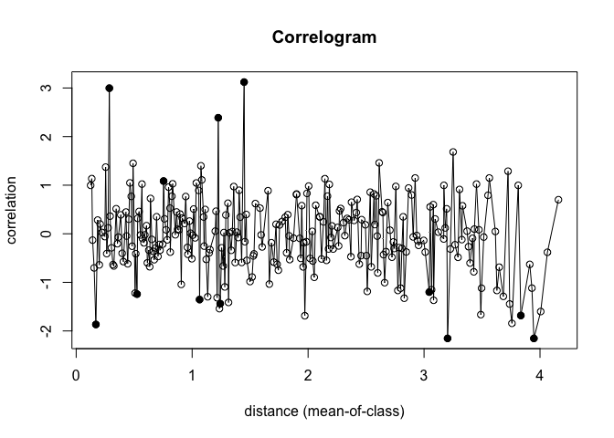
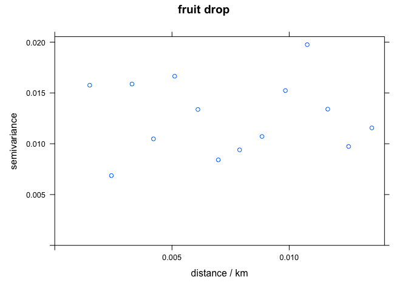
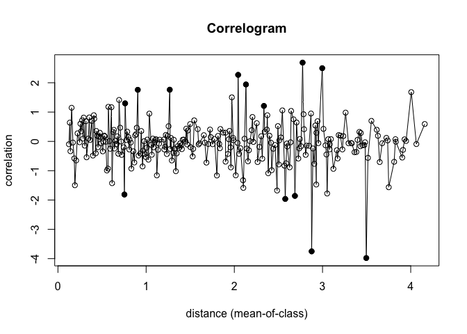
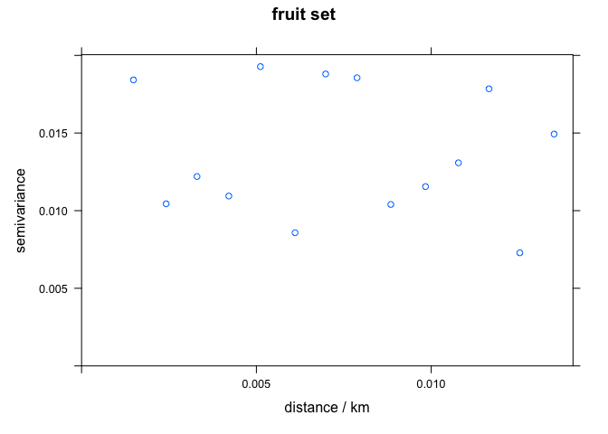
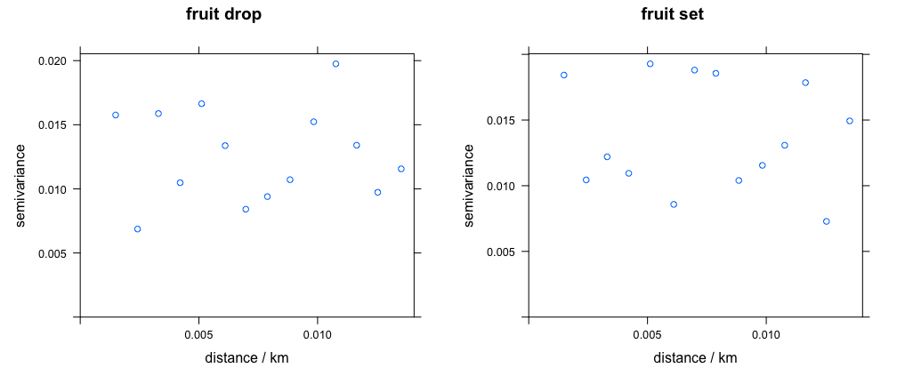

Test for spatial autocorrelation
================
Eleanor Jackson
09 February, 2023

``` r
library("tidyverse")
library("here")
library("sf")
library("ncf")
library("spdep")
library("sp")
library("gridExtra")
```

``` r
readRDS(here::here("data", "clean", "fruit_drop_data.rds")) %>% 
  filter(exclusion == TRUE) %>% 
  group_by(tree_id) %>% 
  summarise(proportion_dropped = median(proportion_dropped)) -> fruit_drop

readRDS(here::here("data", "clean", "hawthorn_plots.rds")) %>%
  select(plot, tree_id, longitude, latitude, dbh, reproductive) %>%
  filter(tree_id == "tree_0") %>%
  mutate(tree_id = as.numeric(plot)) %>% 
  inner_join(fruit_drop) %>% 
  sf::st_as_sf(coords = c("latitude", "longitude"), 
               crs = 4326, remove = FALSE) -> focal_trees
```

    ## Joining with `by = join_by(tree_id)`

``` r
# n = 31
```

## Correlogram

A correlogram shows the correlation coefficient for the series lagged
(in distance) by one delay at a time. e.g. at lag one you’re looking at
the correlation between a point and it’s nearest neighbour. At lag two
you’re looking at the correlation between a point and it’s second
nearest neighbour.

Values close to 1 indicate clustering while values close to -1 indicate
dispersion. A random arrangement would give a value that is close to 0.

``` r
# using 10 m increments
plot(ncf::correlog(x = focal_trees$latitude, y = focal_trees$longitude, 
                   z =  focal_trees$proportion_dropped,
                   latlon = TRUE, increment = 0.01))
```

    ## 100  of  999 200  of  999 300  of  999 400  of  999 500  of  999 600  of  999 700  of  999 800  of  999 900  of  999 

<!-- -->

Here, values significant at a nominal (two-sided) 5%-level are
represented by filled circles and non-significant values by open
circles.

## Moran’s I

The expected value of Moran’s I under the null hypothesis of no spatial
autocorrelation is `-1/(n-1)`, which equals `-0.03333333` for this data.

Values significantly below `-1/(n-1)` indicate negative spatial
autocorrelation and values significantly above `-1/(n-1)` indicate
positive spatial autocorrelation.

``` r
# detect nearest neighbours within a 5 km radius (i.e. whole woodland)
spdep::dnearneigh(focal_trees$geometry, 0, 5, 
                  row.names = focal_trees$tree_id,  
                  longlat = TRUE) -> nn
```

    ## Warning in spdep::dnearneigh(focal_trees$geometry, 0, 5, row.names =
    ## focal_trees$tree_id, : dnearneigh: longlat argument overrides object

``` r
# add spatial weights
lw <- spdep::nb2listw(nn, style = "W", zero.policy = TRUE) 

# Moran's test for spatial autocorrelation
spdep::moran.test(focal_trees$proportion_dropped, lw) 
```

    ## Warning in spdep::moran.test(focal_trees$proportion_dropped, lw): Negative variance,
    ## distribution of variable does not meet test assumptions

    ## Warning in sqrt(VI): NaNs produced

    ## Warning in spdep::moran.test(focal_trees$proportion_dropped, lw): Out-of-range
    ## p-value: reconsider test arguments

    ## 
    ##  Moran I test under randomisation
    ## 
    ## data:  focal_trees$proportion_dropped  
    ## weights: lw    
    ## 
    ## Moran I statistic standard deviate = NaN, p-value = NA
    ## alternative hypothesis: greater
    ## sample estimates:
    ## Moran I statistic       Expectation          Variance 
    ##     -3.225806e-02     -3.225806e-02     -6.353425e-17

Moran’s I is below `-1/(n-1)`, indicating negative spatial correlation,
but it’s not a significant result.

## Variogram

A variogram describes the variance of the difference between values at
two locations.

Here, the x axis represents the distance between traps (km) and each
point represents a pair of observations. The distance at which the
variogram stops increasing and flattens out is the range. Traps which
are closer together than this distance are spatially autocorrelated.

``` r
readRDS(here::here("data", "clean", "hawthorn_plots.rds")) %>%
  select(plot, tree_id, longitude, latitude, dbh, reproductive) %>%
  filter(tree_id == "tree_0") %>%
  mutate(tree_id = as.numeric(plot)) %>% 
  inner_join(fruit_drop) -> focal_trees_sp
```

    ## Joining with `by = join_by(tree_id)`

``` r
sp::coordinates(focal_trees_sp) = ~latitude+longitude

plot(
    gstat::variogram(proportion_dropped ~ 1, data = focal_trees_sp), 
    xlab = "distance / km", main = "fruit drop"
) -> p1

p1
```

<!-- -->

Looks to me like we don’t have any spatial autocorrelation - the
semivariance is fairly flat and quite random.

# Fruit set

``` r
readRDS(here::here("data", "clean", "fruit_set_data.rds")) %>%
  filter(bagged == FALSE) %>%
  filter(n_flowers != 0) %>% 
  filter(!(tree_id %% 1)) %>%
  filter(year == 2023) %>% 
  mutate(fruit_set = n_immature_fruits / n_flowers) %>% 
  group_by(tree_id) %>% 
  summarise(fruit_set = median(fruit_set)) -> fruit_set

readRDS(here::here("data", "clean", "hawthorn_plots.rds")) %>%
  select(plot, tree_id, longitude, latitude, dbh, reproductive) %>%
  filter(tree_id == "tree_0") %>%
  mutate(tree_id = as.numeric(plot)) %>% 
  inner_join(fruit_set, by = c("tree_id" = "tree_id")) %>% 
  sf::st_as_sf(coords = c("latitude", "longitude"), 
               crs = 4326, remove = FALSE) -> fruit_set_trees

# n = 21
```

## Correlogram

``` r
# using 10 m increments
plot(ncf::correlog(x = fruit_set_trees$latitude, y = fruit_set_trees$longitude, 
                   z =  fruit_set_trees$fruit_set,
                   latlon = TRUE, increment = 0.01))
```

    ## 100  of  999 200  of  999 300  of  999 400  of  999 500  of  999 600  of  999 700  of  999 800  of  999 900  of  999 

<!-- -->

## Moran’s I

``` r
# detect nearest neighbours within a 5 km radius (i.e. whole woodland)
spdep::dnearneigh(fruit_set_trees$geometry, 0, 5, 
                  row.names = fruit_set_trees$tree_id,  
                  longlat = TRUE) -> nn
```

    ## Warning in spdep::dnearneigh(fruit_set_trees$geometry, 0, 5, row.names =
    ## fruit_set_trees$tree_id, : dnearneigh: longlat argument overrides object

``` r
# add spatial weights
lw <- spdep::nb2listw(nn, style = "W", zero.policy = TRUE) 

# Moran's test for spatial autocorrelation
spdep::moran.test(fruit_set_trees$fruit_set, lw) 
```

    ## Warning in spdep::moran.test(fruit_set_trees$fruit_set, lw): Negative variance,
    ## distribution of variable does not meet test assumptions

    ## Warning in sqrt(VI): NaNs produced

    ## Warning in spdep::moran.test(fruit_set_trees$fruit_set, lw): Out-of-range
    ## p-value: reconsider test arguments

    ## 
    ##  Moran I test under randomisation
    ## 
    ## data:  fruit_set_trees$fruit_set  
    ## weights: lw    
    ## 
    ## Moran I statistic standard deviate = NaN, p-value = NA
    ## alternative hypothesis: greater
    ## sample estimates:
    ## Moran I statistic       Expectation          Variance 
    ##     -3.225806e-02     -3.225806e-02     -6.006480e-17

## Variogram

``` r
readRDS(here::here("data", "clean", "hawthorn_plots.rds")) %>%
  select(plot, tree_id, longitude, latitude, dbh, reproductive) %>%
  filter(tree_id == "tree_0") %>%
  mutate(tree_id = as.numeric(plot)) %>% 
  inner_join(fruit_set, by = c("tree_id" = "tree_id")) -> fruit_set_trees_sp
  
sp::coordinates(fruit_set_trees_sp) = ~latitude+longitude

plot(
    gstat::variogram(fruit_set ~ 1, data = fruit_set_trees_sp), 
    xlab = "distance / km", main = "fruit set"
) -> p2

p2
```

<!-- -->

``` r
grid.arrange(p1, p2, nrow = 1)
```

<!-- -->
