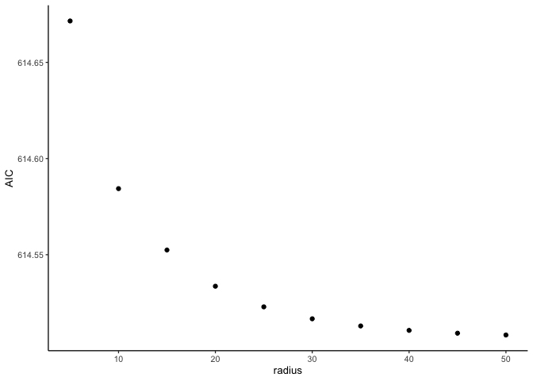

Choose an alpha value for connectivity
================
Eleanor Jackson
10 February, 2023

To determine the buffer radius to use for our connectivity calculation
we will fit models with varying values of *r* and compare their AIC
values. *r* is the average migration distance of Hawthorn enemies and
*r* = 1 / $\alpha$

**Connectivity:**  

$$C_{i} = \sum exp(-\ \alpha \ dist_{ji}) A_{j}$$

``` r
library("tidyverse")
library("geosphere")
```

## Get data

``` r
readRDS(here::here("data", "clean", "fruit_drop_data.rds")) -> fruit_data

readRDS(here::here("data", "clean", "hawthorn_plots.rds")) %>% 
  group_split(plot) -> plot_dfs
```

## Calculate pairwise distances

``` r
calculate_dist <- function (data) {
  
  data %>%
    select(longitude, latitude) -> plot_matrix
  
  geosphere::distm(plot_matrix, 
               fun = distGeo) -> dists
  
  as.data.frame(dists) -> dists_df
  
  unlist(data$tree_id) -> colnames(dists_df) 
  
  cbind(data, dists_df)
  
}

dist_dfs <- lapply(plot_dfs, calculate_dist)

dist_dfs_focal <- map(dist_dfs, ~select(.x, plot, tree_id, tree_0, dbh))
```

## Calculate connectivity using a range of radii

``` r
tibble(radii = seq(5, 50, 5)) -> radii_list

lapply(radii_list, function(x) 1 / x ) -> alpha_list

tidyr::expand_grid(dist_dfs_focal, unlist(alpha_list)) %>% 
  rename(data = dist_dfs_focal, alpha = `unlist(alpha_list)`) -> alpha_dist_dfs

calculate_connectivity <- function (data, alpha) {
  data %>%
    filter(tree_id != "tree_0") %>%
    rename(distance = tree_0) %>%
    filter(distance <= 50) %>%
    mutate(x = exp(- alpha * distance ) * dbh ) %>%
    summarise(connectivity = sum(x),
              plot = plot,
              alpha = eval(parse(text = paste0(alpha)))) %>%
    distinct()
}

connectivity_dfs <- pmap(alpha_dist_dfs, .f = calculate_connectivity)

connectivity_dfs %>%
  dplyr::bind_rows() %>%
  mutate(plot = as.numeric(plot)) -> all_connectivity_dfs

fruit_data %>% 
  filter(exclusion == TRUE) %>%
  right_join(all_connectivity_dfs, by = c("tree_id" = "plot")) %>% 
  mutate(tree_id = as.factor(tree_id)) %>%
  group_by(alpha) %>%
  nest() %>%
  ungroup() %>%
  pull(data) -> connectivity_dfs_alpha
```

## Fit models and look at AIC

``` r
fit_glmms <- function (data) {
  lme4::glmer(
    data,
    formula = cbind(n_dropped, (total_fruit - n_dropped)) ~ 
      log(connectivity) + log(dbh) + (1 | tree_id),
    family = "binomial"
  )
  
}

models <- lapply(connectivity_dfs_alpha, fit_glmms)

lapply(models, AIC) -> AIC_list

tibble(radius = unlist(radii_list), AIC = unlist(AIC_list)) -> AIC_df

AIC_df %>%
  ggplot(aes(x = radius, y = AIC)) + geom_point()
```

<!-- -->

The model using a radius of **50** to calculate connectivity has the
lowest AIC. We don’t have data beyond a 50m radius, but it honestly
looks to me like its levelling off here anyway.
