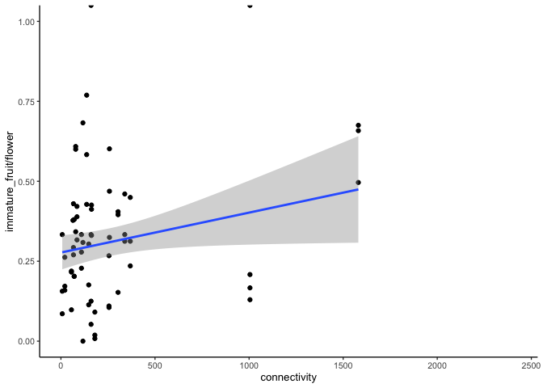
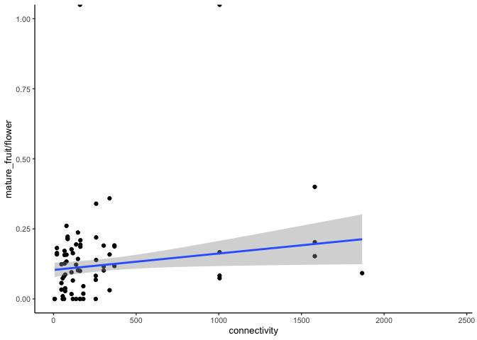
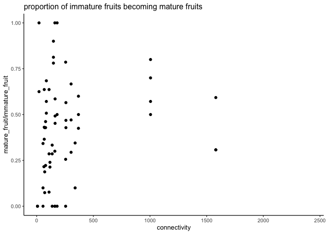
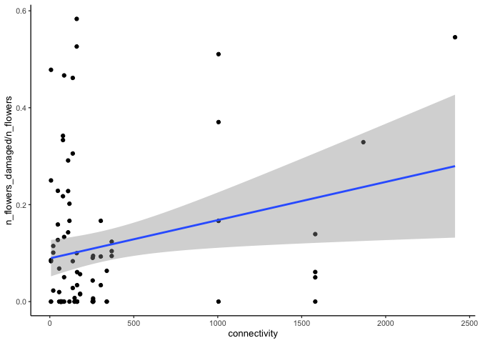

Explore fruit set data
================
eleanorjackson
17 March, 2023

``` r
library("tidyverse")
library("here")
```

``` r
read.csv(here::here("data", "raw", "fruit_set_flower_counts.csv"),
  header = TRUE, na.strings = c("", "NA")) %>% 
  rename(count = n_flowers) %>% 
  mutate(unit = "flower") %>% 
  select(date, tree_id, branch_id, count, unit, bagged, notes) %>% 
  group_by(tree_id, branch_id) %>%
  slice_max(count, with_ties = FALSE) %>% 
  ungroup() -> flowers

read.csv(here::here("data", "raw", "fruit_set_initial_fruit_set.csv"),
  header = TRUE, na.strings = c("", "NA")) %>% 
  rename(count = n_fruits) %>% 
  mutate(unit = "immature_fruit") -> initial_fruit

read.csv(here::here("data", "raw", "fruit_set_final_fruit_set.csv"),
  header = TRUE, na.strings = c("", "NA")) %>% 
  rename(count = n_fruits) %>% 
  mutate(unit = "mature_fruit", bagged = NA) -> final_fruit

readRDS(here::here("data", "clean", "connectivity_data_repro.rds")) %>% 
  select(tree_id, connectivity, dbh) %>% 
  distinct() -> connectivity
```

## initial fruit set \~ reproductive connectivity

``` r
bind_rows(flowers, initial_fruit) %>% 
  pivot_wider(id_cols = c(tree_id, branch_id, bagged), 
              names_from = unit, values_from = count) %>%
  mutate(focal_tree = as.integer(tree_id)) %>% 
  mutate(focal_tree = as.factor(focal_tree)) %>% 
  inner_join(connectivity, by = c("focal_tree" = "tree_id")) %>% 
  filter(bagged == FALSE) %>%  
  ggplot(aes(y = immature_fruit/flower, x = connectivity)) +
  geom_point() +
  geom_smooth(method = "lm") +
  ylim(0, 1)
```

    ## `geom_smooth()` using formula = 'y ~ x'

    ## Warning: Removed 62 rows containing non-finite values (`stat_smooth()`).

    ## Warning: Removed 60 rows containing missing values (`geom_point()`).

<!-- -->

## mature fruit \~ reproductive connectivity

``` r
final_fruit %>% 
  select(tree_id, branch_id) %>% 
  left_join(select(initial_fruit, tree_id, branch_id, bagged)) %>% 
  right_join(final_fruit) %>% 
  mutate(bagged = replace_na(bagged, FALSE)) -> final_fruit_bags
```

    ## Joining with `by = join_by(tree_id, branch_id)`
    ## Joining with `by = join_by(tree_id, branch_id, bagged)`

``` r
bind_rows(flowers, final_fruit_bags) %>% 
  pivot_wider(id_cols = c(tree_id, branch_id, bagged), 
              names_from = unit, values_from = count) %>% 
  mutate(mature_fruit = ifelse(is.na(mature_fruit), 0, mature_fruit)) %>% 
  mutate(focal_tree = as.integer(tree_id)) %>% 
  mutate(focal_tree = as.factor(focal_tree)) %>% 
  inner_join(connectivity, by = c("focal_tree" = "tree_id")) %>% 
  filter(bagged == FALSE) %>%  
  ggplot(aes(y = mature_fruit/flower, x = connectivity)) +
  geom_point() +
  geom_smooth(method = "lm") +
  ylim(0, 1)
```

    ## `geom_smooth()` using formula = 'y ~ x'

    ## Warning: Removed 95 rows containing non-finite values (`stat_smooth()`).

    ## Warning: Removed 93 rows containing missing values (`geom_point()`).

<!-- -->

## mature/immature \~ reproductive connectivity

``` r
bind_rows(initial_fruit, final_fruit_bags) %>% 
  pivot_wider(id_cols = c(tree_id, branch_id, bagged), 
              names_from = unit, values_from = count) %>% 
  mutate(mature_fruit = ifelse(is.na(mature_fruit), 0, mature_fruit)) %>% 
  mutate(focal_tree = as.integer(tree_id)) %>% 
  mutate(focal_tree = as.factor(focal_tree)) %>% 
  inner_join(connectivity, by = c("focal_tree" = "tree_id")) %>% 
  filter(bagged == FALSE) %>%  
  ggplot(aes(y = mature_fruit/immature_fruit, x = connectivity)) +
  geom_point() +
  ylim(0, 1) +
  ggtitle("proportion of immature fruits becoming mature fruits")
```

    ## Warning: Removed 99 rows containing missing values (`geom_point()`).

<!-- -->

## proportion of flowers damaged \~ reproductive connectivity

``` r
read.csv(here::here("data", "raw", "fruit_set_flower_counts.csv"),
  header = TRUE, na.strings = c("", "NA")) %>% 
  group_by(tree_id, branch_id) %>%
  slice_max(n_flowers, with_ties = FALSE) %>% 
  mutate(focal_tree = as.integer(tree_id)) %>% 
  mutate(focal_tree = as.factor(focal_tree)) %>% 
  inner_join(connectivity, by = c("focal_tree" = "tree_id")) %>% 
  ggplot(aes(y = n_flowers_damaged / n_flowers, x = connectivity)) +
  geom_point() +
  geom_smooth(method = "lm")
```

    ## `geom_smooth()` using formula = 'y ~ x'

    ## Warning: Removed 133 rows containing non-finite values (`stat_smooth()`).

    ## Warning: Removed 133 rows containing missing values (`geom_point()`).

<!-- -->
