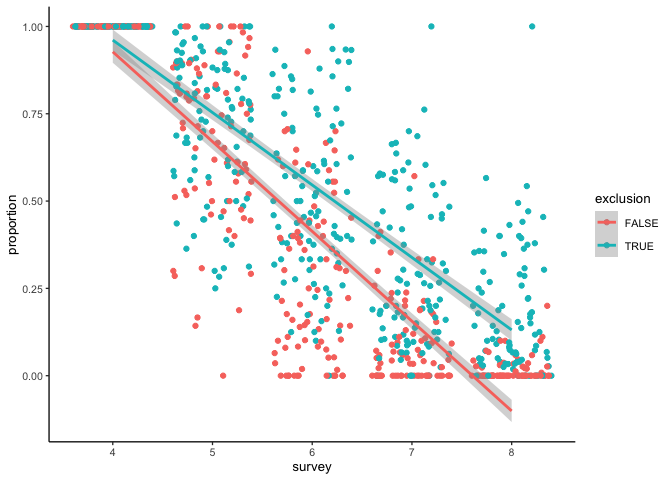
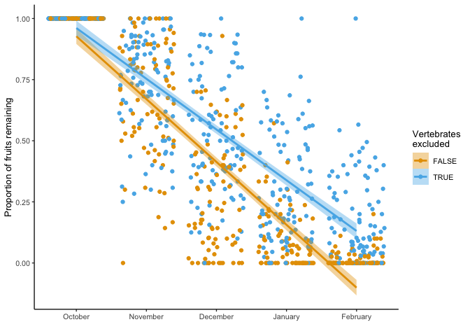

Explore fruit dispersal data
================
eleanorjackson
11 April, 2023

When we protected berries from birds we did it with the aim of isolating
the potential effect of invertebrates on fruit drop. We covered 3 out of
6 branches from each tree with chicken wire. This has actually given us
some nice data on dispersal.

Maybe we can ask questions like:

- did the cages actually work to protect fruits from birds?
- are more connected trees / bigger trees better dispersed?
  - are more fruits dispersed?
  - are fruits dispersed sooner? (no impact on germination of early
    dispersal but could reduce time period when fruit is vulnerable to
    enemies)

``` r
library("tidyverse")
library("here")
```

First to clean up the raw data.

``` r
fruit_counts <- read.csv(here::here("data", "raw", "fruit_drop_data.csv"),
                         header = TRUE, na.strings = c("", "NA"))

fruit_counts %>%
  mutate(date = lubridate::dmy(date), branch = str_sub(branch_id, -1)) %>%
  mutate(branch = tolower(branch)) %>%
  mutate(branch_id = paste0(tree_id, branch)) %>%
  mutate(survey = case_when(
    date == "2022/03/04" | date == "2022/03/06" | date == "2022/03/07" ~ 8,
    date == "2022/01/28" | date == "2022/01/27" ~ 7,
    date == "2021/12/21" | date == "2021/12/20" ~ 6,
    date == "2021/11/25" | date == "2021/11/24" ~ 5,
    date == "2021/10/29" | date == "2021/10/28" ~ 4,
    date == "2021/09/29" | date == "2021/09/28" | date == "2021/09/27" ~ 3,
    date == "2021/09/02" ~ 2,
    date == "2021/08/06" | date == "2021/08/05" ~ 1,
  )) %>%
  mutate(exclusion = ifelse(branch == "d" | branch == "e" | branch == "f",
                            FALSE, TRUE)) %>%
  group_by(branch_id) %>%
  reframe(across(date:exclusion),
          length_cm = median(length_cm, na.rm = TRUE)) %>%
  select(- branch, - notes) -> survey_data

# add dbh for each tree
readRDS(here::here("data", "clean", "hawthorn_plots.rds")) %>%
  filter(tree_id == "tree_0") %>%
  mutate(plot = as.numeric(plot)) %>%
  select(plot, dbh) %>%
  inner_join(survey_data, by = c("plot" = "tree_id"),
             multiple = "all") %>%
  rename(tree_id = plot) -> survey_data_dbh

# add connectivity data for each tree
readRDS(here::here("data", "clean", "connectivity_data.rds")) %>%
  inner_join(survey_data_dbh, by = c("plot" = "tree_id"),
             multiple = "all") %>%
  rename(tree_id = plot) %>%
  group_by(branch_id) %>%
  # calculate proportions per branch for each time point
  mutate(max_fruit = max(n_fruit)) %>% 
  mutate(proportion = n_fruit / max_fruit) %>%
  ungroup() %>%
  # make the first survey count = the max count of fruit per branch
  mutate(proportion = ifelse(proportion > 1, proportion == 1, proportion)) %>%
  filter(!((survey == 2 | survey == 1) & exclusion == FALSE)) %>%
  mutate(proportion = ifelse(survey == 1, 1, proportion)) %>%
  mutate(proportion = ifelse(survey == 3 & exclusion == FALSE, 1, proportion)
         ) -> survey_data_con
```

## Did the exclusions have an effect on how quickly fruit was lost?

``` r
survey_data_con %>%
  ggplot(aes(x = survey, y = proportion, 
             group = exclusion, colour = exclusion)) +
  geom_jitter() +
  geom_smooth(method = "lm")
```

    ## `geom_smooth()` using formula = 'y ~ x'

<!-- -->

Yes - looks like open branches lost their fruits at a faster rate
compared to branches that were protected. But is this just a function of
the caged branches being recorded earlier..?

``` r
survey_data_con %>%
  filter(survey %in% c(4, 5, 6, 7, 8) ) %>% 
  ggplot(aes(x = survey, y = proportion, 
             group = exclusion, colour = exclusion)) +
  geom_jitter() +
  geom_smooth(method = "lm")
```

    ## `geom_smooth()` using formula = 'y ~ x'

<!-- -->

Ok, it’s still steeper! Probably better to report the second one though
as it was only from that point that I added the exclusions. Maybe I
should re-calculate the proportion dropped for branches with exclusions
with survey 4 as the first time point (total fruits).

``` r
survey_data_con %>%
  filter(survey %in% c(4, 5, 6, 7, 8) ) %>% 
  group_by(branch_id) %>%
  # calculate proportions per branch for each time point
  mutate(max_fruit = max(n_fruit)) %>% 
  mutate(proportion = n_fruit / max_fruit) %>%
  ungroup() %>% 
  # make the first survey count = the max count of fruit per branch
  mutate(proportion = ifelse(proportion > 1, proportion == 1, proportion)) %>%
  mutate(proportion = ifelse(survey == 4, 1, proportion)) %>%
  ggplot(aes(x = survey, y = proportion, 
             group = exclusion, colour = exclusion)) +
  geom_jitter() +
  geom_smooth(method = "lm")
```

    ## `geom_smooth()` using formula = 'y ~ x'

<!-- -->

Ok that is also reassuring, and probably the plot we want to go with.
Even though we aren’t presenting all the available data, this makes the
two groups comparable. Let’s make it pretty.

``` r
survey_data_con %>%
  filter(survey %in% c(4, 5, 6, 7, 8) ) %>% 
  group_by(branch_id) %>%
  mutate(max_fruit = max(n_fruit)) %>% 
  mutate(proportion = n_fruit / max_fruit) %>%
  ungroup() %>% 
  mutate(proportion = ifelse(proportion > 1, proportion == 1, proportion)) %>%
  mutate(proportion = ifelse(survey == 4, 1, proportion)) %>%
  mutate(month = case_when(survey == 4 ~ "October",
                           survey == 5 ~ "November",
                           survey == 6 ~ "December",
                           survey == 7 ~ "January",
                           survey == 8 ~ "February")) %>% 
  ggplot(aes(x = reorder(month, survey), y = proportion, 
             group = exclusion, colour = exclusion, fill = exclusion)) +
  geom_jitter() +
  geom_smooth(method = "lm") +
  xlab("") +
  ylab("Proportion of fruits remaining") +
  labs(fill = "Vertebrates\nexcluded", colour = "Vertebrates\nexcluded") +
  scale_color_manual(values = c("#E69F00", "#56B4E9")) +
  scale_fill_manual(values = c("#E69F00", "#56B4E9"))
```

    ## `geom_smooth()` using formula = 'y ~ x'

<!-- -->

## Are more connected trees / bigger trees better dispersed?

By the last survey nearly all the fruits were taken from non-protected
branches, so I think we have to look at this in terms of how quickly the
fruits were taken. We could expect to see trees with higher connectivity
/ dbh having a steeper slope - a stronger relationship between
proportion of fruits dispersed and time.

Let’s first try plotting it to see if we can eyeball.

``` r
survey_data_con %>%
  filter(exclusion == FALSE) %>%
  ggplot(aes(x = survey, y = proportion, group = tree_id, colour = log(connectivity)),
  ) +
  geom_jitter() +
  geom_smooth( method = "lm", se = FALSE)
```

    ## `geom_smooth()` using formula = 'y ~ x'

<!-- -->

``` r
survey_data_con %>%
  filter(exclusion == FALSE) %>%
  ggplot(aes(x = survey, y = proportion, group = tree_id, colour = log(dbh)),
  ) +
  geom_jitter() +
  geom_smooth( method = "lm", se = FALSE)
```

    ## `geom_smooth()` using formula = 'y ~ x'

<!-- -->

I can’t really see any patterns here. Let try and get some numbers out.
If we run a linear regression we can pull out the coefficients (i.e. a
value to describe how steep the slope is). Think I’ll do a mixed-effects
model to allow the model to borrow information from other trees. We
don’t have masses of data on the per tree level.

``` r
lme4::glmer(formula = cbind(n_fruit, (max_fruit - n_fruit))
   ~ survey + (1 + survey | tree_id),
   data = filter(survey_data_con, exclusion == FALSE),
   family = binomial(link = "logit")) -> mod

coef(mod)$tree_id %>%
  rownames_to_column(var = "tree_id") %>%
  rename(intercept = `(Intercept)`, slope = survey) %>%
  mutate(tree_id = as.numeric(tree_id)) -> coefs

glimpse(coefs)
```

    ## Rows: 28
    ## Columns: 3
    ## $ tree_id   <dbl> 1, 3, 4, 5, 6, 7, 8, 9, 10, 11, 12, 13, 14, 15, 16, 17, 18, …
    ## $ intercept <dbl> 8.348105, 9.107582, 7.543537, 15.243363, 7.181375, 10.326055…
    ## $ slope     <dbl> -1.628365, -1.825940, -1.257172, -2.870187, -1.261435, -2.18…

Now that we have the slope values I’m going to try plotting them against
connectivity and dbh to see if there’s a pattern.

``` r
survey_data_con %>%
  filter(exclusion == FALSE) %>% 
  select(tree_id, repro_connectivity) %>%
  distinct() %>%
  right_join(coefs) %>%
  ggplot(aes(x = repro_connectivity, y = slope)) + 
  geom_point() + 
  geom_smooth(method = "lm")
```

    ## Joining with `by = join_by(tree_id)`
    ## `geom_smooth()` using formula = 'y ~ x'

<!-- -->

So this is telling us that trees which are more connected had their
berries taken quicker. Perhaps birds are more likely to visit areas
where there are many reproductive hawthorn.

Testing the relationship with a linear model:

``` r
survey_data_con %>%
  filter(exclusion == FALSE) %>% 
  select(tree_id, repro_connectivity, dbh) %>%
  distinct() %>%
  right_join(coefs) -> rate_data
```

    ## Joining with `by = join_by(tree_id)`

``` r
glm(formula = scale(slope) ~ scale(repro_connectivity),
   data = rate_data) -> rate_connect_mod

summary(rate_connect_mod)
```

    ## 
    ## Call:
    ## glm(formula = scale(slope) ~ scale(repro_connectivity), data = rate_data)
    ## 
    ## Deviance Residuals: 
    ##     Min       1Q   Median       3Q      Max  
    ## -2.5783  -0.3968   0.1133   0.4018   1.4622  
    ## 
    ## Coefficients:
    ##                             Estimate Std. Error t value Pr(>|t|)  
    ## (Intercept)                5.627e-16  1.794e-01   0.000   1.0000  
    ## scale(repro_connectivity) -3.637e-01  1.827e-01  -1.991   0.0571 .
    ## ---
    ## Signif. codes:  0 '***' 0.001 '**' 0.01 '*' 0.05 '.' 0.1 ' ' 1
    ## 
    ## (Dispersion parameter for gaussian family taken to be 0.9010999)
    ## 
    ##     Null deviance: 27.000  on 27  degrees of freedom
    ## Residual deviance: 23.429  on 26  degrees of freedom
    ## AIC: 80.47
    ## 
    ## Number of Fisher Scoring iterations: 2

p is not \< 0.05, I’m not too surprised since we have few data points at
the higher end of connectivity.

Let’s look at dbh:

``` r
rate_data %>%
  ggplot(aes(x = dbh, y = slope)) + 
  geom_point() + 
  geom_smooth(method = "lm")
```

    ## `geom_smooth()` using formula = 'y ~ x'

<!-- -->

``` r
glm(formula = scale(slope) ~ scale(dbh),
   data = rate_data) -> rate_dbh_mod

summary(rate_dbh_mod)
```

    ## 
    ## Call:
    ## glm(formula = scale(slope) ~ scale(dbh), data = rate_data)
    ## 
    ## Deviance Residuals: 
    ##     Min       1Q   Median       3Q      Max  
    ## -2.5427  -0.5879  -0.1560   0.6631   1.6817  
    ## 
    ## Coefficients:
    ##              Estimate Std. Error t value Pr(>|t|)
    ## (Intercept) 5.213e-16  1.835e-01   0.000    1.000
    ## scale(dbh)  3.035e-01  1.869e-01   1.624    0.116
    ## 
    ## (Dispersion parameter for gaussian family taken to be 0.9427949)
    ## 
    ##     Null deviance: 27.000  on 27  degrees of freedom
    ## Residual deviance: 24.513  on 26  degrees of freedom
    ## AIC: 81.736
    ## 
    ## Number of Fisher Scoring iterations: 2

Trees that were larger had their berries taken slower. This would kind
of make sense… if there are more berries on the tree there would be more
choice for the birds - less chance they’ll take ones that we are
monitoring.

However, the trends don’t look super convincing to me and they are both
non-significant relationships according to the models.

Maybe we need a different connectivity measure for birds anyway because
they can travel much further distances than insect predators and
pollinators.
