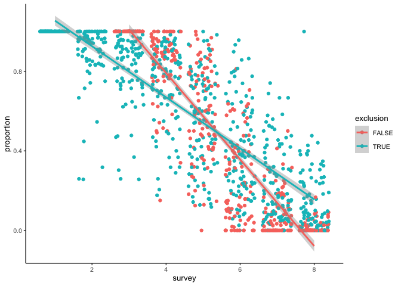
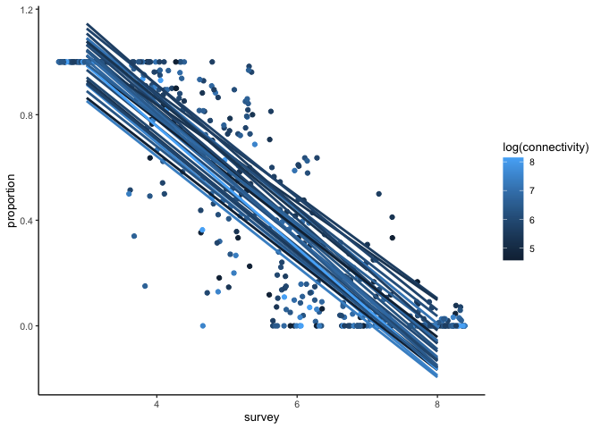

Explore fruit dispersal data
================
eleanorjackson
28 March, 2023

When we protected berries from birds we did it with the aim of isolating
the potential effect of invertebrates on fruit drop. We covered 3 out of
6 branches from each tree with chicken wire. This has actually given us
some nice data on dispersal.

Maybe we can ask questions like:

- did the cages actually work to protect fruits from birds
- are more connected trees / bigger trees better dispersed?
  - are more fruits dispersed?
  - are fruits dispersed sooner? (does this even have an impact on
    germination?)

``` r
library("tidyverse")
library("here")
```

First to clean up the raw data.

``` r
fruit_counts <- read.csv(here::here("data", "raw", "fruit_drop_data.csv"),
                         header = TRUE, na.strings = c("", "NA"))

fruit_counts %>%
  mutate(date = lubridate::dmy(date), branch = str_sub(branch_id, -1)) %>%
  mutate(branch = tolower(branch)) %>%
  mutate(branch_id = paste0(tree_id, branch)) %>%
  mutate(survey = case_when(
    date == "2022/03/04" | date == "2022/03/06" | date == "2022/03/07" ~ 8,
    date == "2022/01/28" | date == "2022/01/27" ~ 7,
    date == "2021/12/21" | date == "2021/12/20" ~ 6,
    date == "2021/11/25" | date == "2021/11/24" ~ 5,
    date == "2021/10/29" | date == "2021/10/28" ~ 4,
    date == "2021/09/29" | date == "2021/09/28" | date == "2021/09/27" ~ 3,
    date == "2021/09/02" ~ 2,
    date == "2021/08/06" | date == "2021/08/05" ~ 1,
  )) %>%
  mutate(exclusion = ifelse(branch == "d" | branch == "e" | branch == "f",
                            FALSE, TRUE)) %>%
  group_by(branch_id) %>%
  reframe(across(date:exclusion),
          length_cm = median(length_cm, na.rm = TRUE)) %>%
  select(- branch, - notes) -> survey_data

# add dbh for each tree
readRDS(here::here("data", "clean", "hawthorn_plots.rds")) %>%
  filter(tree_id == "tree_0") %>%
  mutate(plot = as.numeric(plot)) %>%
  select(plot, dbh) %>%
  inner_join(survey_data, by = c("plot" = "tree_id"),
             multiple = "all") %>%
  rename(tree_id = plot) -> survey_data_dbh

# add connectivity data for each tree
readRDS(here::here("data", "clean", "connectivity_data.rds")) %>%
  inner_join(survey_data_dbh, by = c("plot" = "tree_id"),
             multiple = "all") %>%
  rename(tree_id = plot) %>%
  group_by(branch_id) %>%
  # calculate proportions per branch for each time point
  mutate(max_fruit = max(n_fruit)) %>% 
  mutate(proportion = n_fruit / max_fruit) %>%
  ungroup() %>%
  # make the first survey count = the max count of fruit per branch
  mutate(proportion = ifelse(proportion > 1, proportion == 1, proportion)) %>%
  filter(!((survey == 2 | survey == 1) & exclusion == FALSE)) %>%
  mutate(proportion = ifelse(survey == 1, 1, proportion)) %>%
  mutate(proportion = ifelse(survey == 3 & exclusion == FALSE, 1, proportion)
         ) -> survey_data_con
```

## Did the exclusions have an effect on how quickly fruit was lost?

``` r
survey_data_con %>%
  ggplot(aes(x = survey, y = proportion, 
             group = exclusion, colour = exclusion)) +
  geom_jitter() +
  geom_smooth(method = "lm")
```

    ## `geom_smooth()` using formula = 'y ~ x'

<!-- -->

Yes - looks like branches that were protected lost their fruits at a
faster rate compared to open branches. But is this just a function of
the caged branches being recorded earlier..

``` r
survey_data_con %>%
  filter(survey %in% c(4, 5, 6, 7, 8) ) %>% 
  ggplot(aes(x = survey, y = proportion, 
             group = exclusion, colour = exclusion)) +
  geom_jitter() +
  geom_smooth(method = "lm")
```

    ## `geom_smooth()` using formula = 'y ~ x'

<!-- -->

Ok, no it’s still steeper! Probably better to report the second one
though as it did change the slopes?

## Are more connected trees / bigger trees better dispersed?

By the last survey nearly all the fruits were taken from non-protected
branches, so I think we have to look at this in terms of how quickly the
fruits were taken. We could expect to see trees with higher connectivity
/ dbh having a steeper slope - a stronger relationship between
proportion of fruits dispersed and time.

Let’s first try plotting it to see if we can eyeball.

``` r
survey_data_con %>%
  filter(exclusion == FALSE) %>%
  ggplot(aes(x = survey, y = proportion, group = tree_id, colour = log(connectivity)),
  ) +
  geom_jitter() +
  geom_smooth( method = "lm", se = FALSE)
```

    ## `geom_smooth()` using formula = 'y ~ x'

<!-- -->

``` r
survey_data_con %>%
  filter(exclusion == FALSE) %>%
  ggplot(aes(x = survey, y = proportion, group = tree_id, colour = log(dbh)),
  ) +
  geom_jitter() +
  geom_smooth( method = "lm", se = FALSE)
```

    ## `geom_smooth()` using formula = 'y ~ x'

<!-- -->

I can’t really see any patterns here. Let try and get some numbers out.
If we run a linear regression we can pull out the coefficients (i.e. a
value to describe how steep the slope is). Think I’ll do a mixed-effects
model to allow the model to borrow information from other trees. We
don’t have masses of data on the per tree level.

``` r
lme4::glmer(formula = cbind(n_fruit, (max_fruit - n_fruit))
   ~ survey + (1 + survey | tree_id),
   data = filter(survey_data_con, exclusion == FALSE),
   family = binomial(link = "logit")) -> mod

coef(mod)$tree_id %>%
  rownames_to_column(var = "tree_id") %>%
  rename(intercept = `(Intercept)`, slope = survey) %>%
  mutate(tree_id = as.numeric(tree_id)) -> coefs

glimpse(coefs)
```

    ## Rows: 27
    ## Columns: 3
    ## $ tree_id   <dbl> 1, 3, 4, 5, 6, 7, 8, 9, 10, 11, 12, 13, 14, 15, 16, 17, 18, …
    ## $ intercept <dbl> 8.346124, 9.109066, 7.536695, 15.313075, 7.178646, 10.336142…
    ## $ slope     <dbl> -1.628117, -1.826789, -1.256156, -2.883241, -1.261019, -2.19…

Now that we have the slope values I’m going to try plotting them against
connectivity and dbh to see if there’s a pattern.

``` r
survey_data_con %>%
  select(tree_id, repro_connectivity) %>%
  distinct() %>%
  right_join(coefs) %>%
  ggplot(aes(x = repro_connectivity, y = slope)) + 
  geom_point() + 
  geom_smooth(method = "lm")
```

    ## Joining with `by = join_by(tree_id)`
    ## `geom_smooth()` using formula = 'y ~ x'

<!-- -->

So this is telling us that trees which are more connected had their
berries taken quicker. Perhaps birds are more likely to visit areas
where there are many reproductive hawthorn.

``` r
survey_data_con %>%
  select(tree_id, dbh) %>%
  distinct() %>%
  right_join(coefs) %>%
  ggplot(aes(x = dbh, y = slope)) + 
  geom_point() + 
  geom_smooth(method = "lm")
```

    ## Joining with `by = join_by(tree_id)`
    ## `geom_smooth()` using formula = 'y ~ x'

<!-- -->

And trees that were larger had their berries taken slower. This would
kind of make sense… if there are more berries on the tree there would be
more choice for the birds - less chance they’ll take ones that we are
monitoring.

However, the trends don’t look super convincing to me. We could model
the coefficients against dbh and connectivity? Is it valid to build a
model off of the coefficients of another model?
