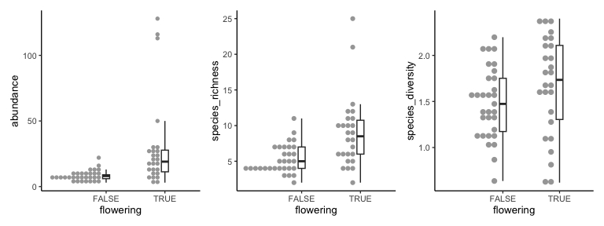
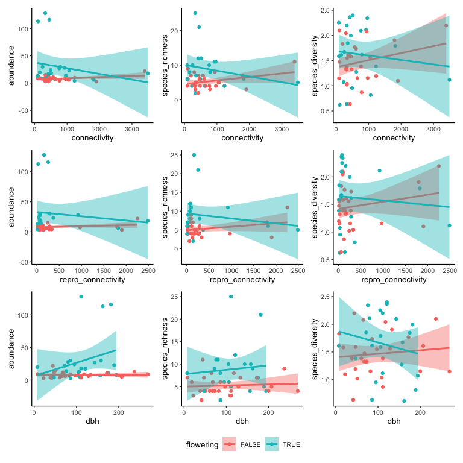

Beetle sampling data
================
eleanorjackson
03 May, 2023

Taking a very quick look at Susie’s data.

``` r
library("tidyverse")
library("here")
library("janitor")
library("patchwork")
library("vegan")
```

``` r
read_csv(here::here("data", "raw", "beetle_sampling.csv")) %>% 
  clean_names() %>% 
  mutate(
    date = convert_to_date(date, character_fun = lubridate::dmy)
    ) -> pooled_data
```

    ## Rows: 530 Columns: 10
    ## ── Column specification ────────────────────────────────────────────────────────
    ## Delimiter: ","
    ## chr (4): date, species_genus, family, notes
    ## dbl (4): tree_id, branch, repeat, n
    ## lgl (2): flowering, end_of_flowering
    ## 
    ## ℹ Use `spec()` to retrieve the full column specification for this data.
    ## ℹ Specify the column types or set `show_col_types = FALSE` to quiet this message.

``` r
pooled_data %>% 
  uncount(n) -> unpooled_data
```

## Calculate Shannon diversity

``` r
unpooled_data %>% 
  filter(species_genus != "unknown") %>% 
  summarise(abundance = n(), .by = c(species_genus, tree_id)) %>% 
  pivot_wider(names_from = species_genus, values_from = abundance) %>% 
  column_to_rownames("tree_id") %>% 
  replace(is.na(.), 0) -> diversity_matrix_sp

diversity(diversity_matrix_sp) %>% 
  as_tibble(rownames = "tree_id") %>% 
  rename(species_diversity = value) -> diversity_sp

unpooled_data %>% 
  filter(family != "unknown") %>% 
  summarise(abundance = n(), .by = c(family, tree_id)) %>% 
  pivot_wider(names_from = family, values_from = abundance) %>% 
  column_to_rownames("tree_id") %>% 
  replace(is.na(.), 0) -> diversity_matrix_fam

diversity(diversity_matrix_fam) %>% 
  as_tibble(rownames = "tree_id") %>% 
  rename(family_diversity = value) -> diversity_fam
```

## Calculate richness

``` r
unpooled_data %>% 
  filter(species_genus != "unknown") %>% 
  summarise(species_richness = n_distinct(species_genus), 
            .by = tree_id) -> rich_sp

unpooled_data %>% 
  filter(family != "unknown") %>% 
  summarise(family_richness = n_distinct(family), 
            .by = tree_id) -> rich_fam
```

## Combine with abundance

``` r
unpooled_data %>% 
  filter(species_genus != "unknown") %>% 
  summarise(abundance = n(), .by = c(tree_id, flowering)) -> abund_data

abund_data %>% 
  left_join(rich_fam) %>% 
  left_join(rich_sp) %>%
  mutate(tree_id = as.character(tree_id)) %>% 
  left_join(diversity_fam) %>% 
  left_join(diversity_sp) %>%
  mutate(tree_id = as.numeric(tree_id)) -> indices
```

    ## Joining with `by = join_by(tree_id)`
    ## Joining with `by = join_by(tree_id)`
    ## Joining with `by = join_by(tree_id)`
    ## Joining with `by = join_by(tree_id)`

``` r
readRDS(here::here("data", "clean", "connectivity_data.rds")) %>% 
  select(plot, connectivity, repro_connectivity) %>% 
  full_join(indices, by = c("plot" = "tree_id"))  -> indices_con

readRDS(here::here("data", "clean", "hawthorn_plots.rds")) %>%
  filter(tree_id == "tree_0") %>%
  mutate(plot = as.numeric(plot)) %>%
  select(plot, dbh) %>% 
  full_join(indices_con, by = "plot") %>% 
  rename(tree_id = plot) %>% 
  drop_na(flowering) -> plotting_data
```

## Flowering vs non-flowering trees

<!-- -->

## Connectivity and dbh

<!-- -->

``` r
glm(species_diversity ~ connectivity * dbh * flowering, data = plotting_data) %>% 
  summary()
```

    ## 
    ## Call:
    ## glm(formula = species_diversity ~ connectivity * dbh * flowering, 
    ##     data = plotting_data)
    ## 
    ## Deviance Residuals: 
    ##      Min        1Q    Median        3Q       Max  
    ## -1.08503  -0.34350  -0.01477   0.32755   0.76419  
    ## 
    ## Coefficients:
    ##                                  Estimate Std. Error t value Pr(>|t|)    
    ## (Intercept)                     1.261e+00  2.166e-01   5.823 6.62e-07 ***
    ## connectivity                    1.398e-04  2.241e-04   0.624    0.536    
    ## dbh                             8.916e-04  1.825e-03   0.489    0.628    
    ## floweringTRUE                   5.600e-01  5.133e-01   1.091    0.281    
    ## connectivity:dbh                3.905e-07  2.958e-06   0.132    0.896    
    ## connectivity:floweringTRUE      2.293e-05  6.963e-04   0.033    0.974    
    ## dbh:floweringTRUE              -1.875e-03  4.166e-03  -0.450    0.655    
    ## connectivity:dbh:floweringTRUE -2.822e-06  6.567e-06  -0.430    0.670    
    ## ---
    ## Signif. codes:  0 '***' 0.001 '**' 0.01 '*' 0.05 '.' 0.1 ' ' 1
    ## 
    ## (Dispersion parameter for gaussian family taken to be 0.2409658)
    ## 
    ##     Null deviance: 11.436  on 50  degrees of freedom
    ## Residual deviance: 10.362  on 43  degrees of freedom
    ##   (6 observations deleted due to missingness)
    ## AIC: 81.452
    ## 
    ## Number of Fisher Scoring iterations: 2

``` r
glm(species_diversity ~ repro_connectivity * dbh * flowering, data = plotting_data) %>% 
  summary()
```

    ## 
    ## Call:
    ## glm(formula = species_diversity ~ repro_connectivity * dbh * 
    ##     flowering, data = plotting_data)
    ## 
    ## Deviance Residuals: 
    ##      Min        1Q    Median        3Q       Max  
    ## -1.07872  -0.30192  -0.00002   0.28219   0.74159  
    ## 
    ## Coefficients:
    ##                                        Estimate Std. Error t value Pr(>|t|)    
    ## (Intercept)                           1.356e+00  1.841e-01   7.365 3.82e-09 ***
    ## repro_connectivity                    4.606e-05  2.635e-04   0.175    0.862    
    ## dbh                                   5.172e-04  1.565e-03   0.331    0.743    
    ## floweringTRUE                         2.818e-01  3.999e-01   0.705    0.485    
    ## repro_connectivity:dbh                1.530e-06  3.340e-06   0.458    0.649    
    ## repro_connectivity:floweringTRUE      1.814e-03  1.463e-03   1.240    0.222    
    ## dbh:floweringTRUE                    -1.302e-04  3.285e-03  -0.040    0.969    
    ## repro_connectivity:dbh:floweringTRUE -1.959e-05  1.363e-05  -1.437    0.158    
    ## ---
    ## Signif. codes:  0 '***' 0.001 '**' 0.01 '*' 0.05 '.' 0.1 ' ' 1
    ## 
    ## (Dispersion parameter for gaussian family taken to be 0.2351476)
    ## 
    ##     Null deviance: 11.436  on 50  degrees of freedom
    ## Residual deviance: 10.111  on 43  degrees of freedom
    ##   (6 observations deleted due to missingness)
    ## AIC: 80.205
    ## 
    ## Number of Fisher Scoring iterations: 2

## Possible pollinators

Assuming that species only found on flowering trees are pollinators.
Does this change any patterns?

``` r
unpooled_data %>% 
  filter(species_genus != "unknown") %>% 
  filter(flowering == TRUE) %>% 
  distinct(species_genus) -> on_flowers

unpooled_data %>% 
  filter(species_genus != "unknown") %>% 
  filter(flowering == FALSE) %>% 
  distinct(species_genus) -> not_on_flowers

setdiff(on_flowers, not_on_flowers) -> poss_pollinators

unpooled_data %>% 
  filter(species_genus %in% poss_pollinators$species_genus) -> pollinator_data
```

``` r
#richness
pollinator_data %>% 
  filter(species_genus != "unknown") %>% 
  summarise(species_richness = n_distinct(species_genus), .by = tree_id) -> rich_sp_pol

# abundance
pollinator_data %>% 
  filter(species_genus != "unknown") %>% 
  summarise(abundance = n(), .by = tree_id) -> abund_data_pol

#diversity
pollinator_data %>% 
  filter(species_genus != "unknown") %>% 
  summarise(abundance = n(), .by = c(species_genus, tree_id)) %>% 
  pivot_wider(names_from = species_genus, values_from = abundance) %>% 
  column_to_rownames("tree_id") %>% 
  replace(is.na(.), 0) -> diversity_matrix_sp_pol

diversity(diversity_matrix_sp) %>% 
  as_tibble(rownames = "tree_id") %>% 
  rename(species_diversity = value) -> diversity_sp_pol

plotting_data %>% 
  select(tree_id, dbh, connectivity, repro_connectivity, flowering) %>% 
  filter(flowering == TRUE) %>% 
  left_join(rich_sp_pol) %>% 
  left_join(abund_data_pol) %>% 
  mutate(tree_id = as.character(tree_id)) %>%
  left_join(diversity_sp_pol) -> plotting_data_pol
```

<!-- -->

``` r
glm(species_diversity ~ connectivity * dbh, data = plotting_data_pol) %>% 
  summary()
```

    ## 
    ## Call:
    ## glm(formula = species_diversity ~ connectivity * dbh, data = plotting_data_pol)
    ## 
    ## Deviance Residuals: 
    ##      Min        1Q    Median        3Q       Max  
    ## -1.08503  -0.40034  -0.01057   0.51157   0.76419  
    ## 
    ## Coefficients:
    ##                    Estimate Std. Error t value Pr(>|t|)   
    ## (Intercept)       1.821e+00  5.714e-01   3.188   0.0051 **
    ## connectivity      1.627e-04  8.096e-04   0.201   0.8430   
    ## dbh              -9.834e-04  4.599e-03  -0.214   0.8331   
    ## connectivity:dbh -2.431e-06  7.200e-06  -0.338   0.7395   
    ## ---
    ## Signif. codes:  0 '***' 0.001 '**' 0.01 '*' 0.05 '.' 0.1 ' ' 1
    ## 
    ## (Dispersion parameter for gaussian family taken to be 0.3633832)
    ## 
    ##     Null deviance: 6.9039  on 21  degrees of freedom
    ## Residual deviance: 6.5409  on 18  degrees of freedom
    ##   (4 observations deleted due to missingness)
    ## AIC: 45.748
    ## 
    ## Number of Fisher Scoring iterations: 2

``` r
glm(species_diversity ~ repro_connectivity * dbh, data = plotting_data_pol) %>% 
  summary()
```

    ## 
    ## Call:
    ## glm(formula = species_diversity ~ repro_connectivity * dbh, data = plotting_data_pol)
    ## 
    ## Deviance Residuals: 
    ##      Min        1Q    Median        3Q       Max  
    ## -1.07872  -0.26066  -0.02413   0.52021   0.74159  
    ## 
    ## Coefficients:
    ##                          Estimate Std. Error t value Pr(>|t|)   
    ## (Intercept)             1.638e+00  4.297e-01   3.811  0.00128 **
    ## repro_connectivity      1.860e-03  1.741e-03   1.068  0.29967   
    ## dbh                     3.870e-04  3.496e-03   0.111  0.91306   
    ## repro_connectivity:dbh -1.806e-05  1.600e-05  -1.129  0.27372   
    ## ---
    ## Signif. codes:  0 '***' 0.001 '**' 0.01 '*' 0.05 '.' 0.1 ' ' 1
    ## 
    ## (Dispersion parameter for gaussian family taken to be 0.344485)
    ## 
    ##     Null deviance: 6.9039  on 21  degrees of freedom
    ## Residual deviance: 6.2007  on 18  degrees of freedom
    ##   (4 observations deleted due to missingness)
    ## AIC: 44.573
    ## 
    ## Number of Fisher Scoring iterations: 2
