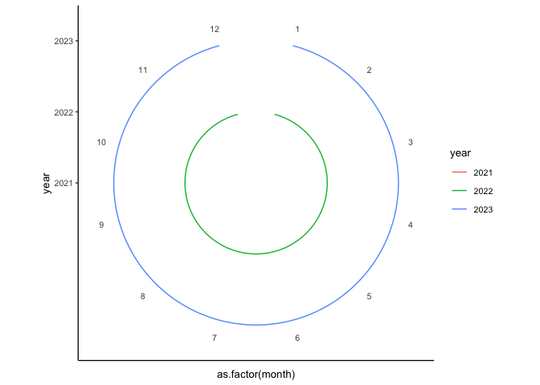
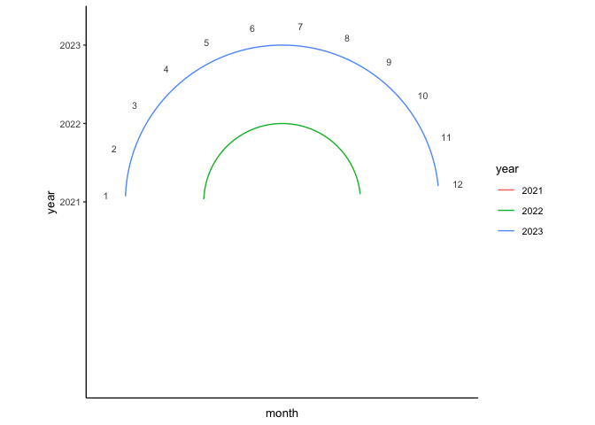
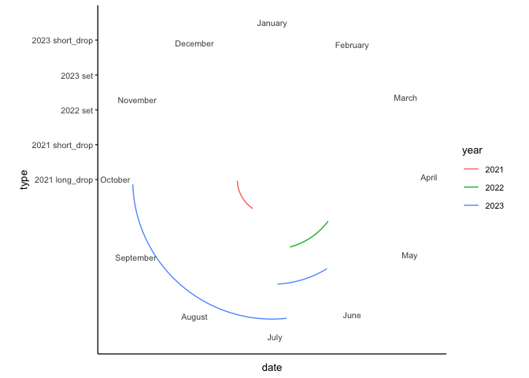
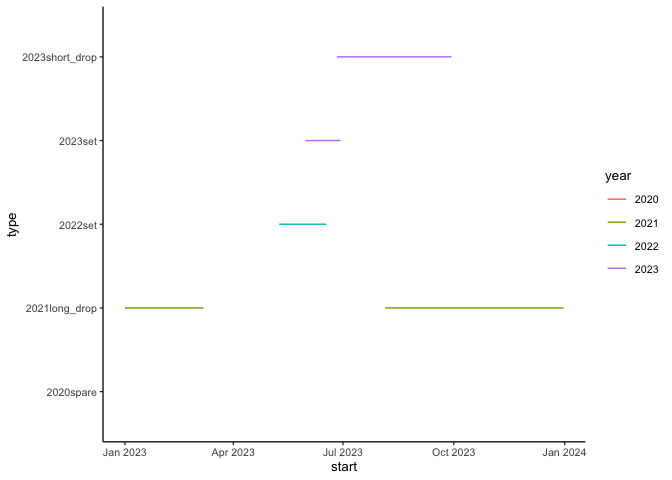
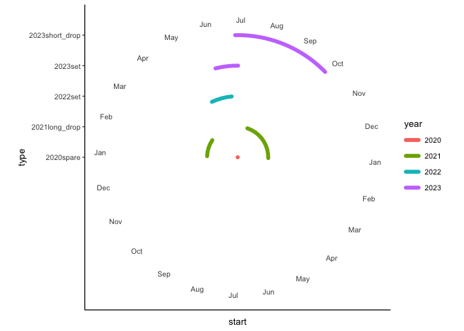
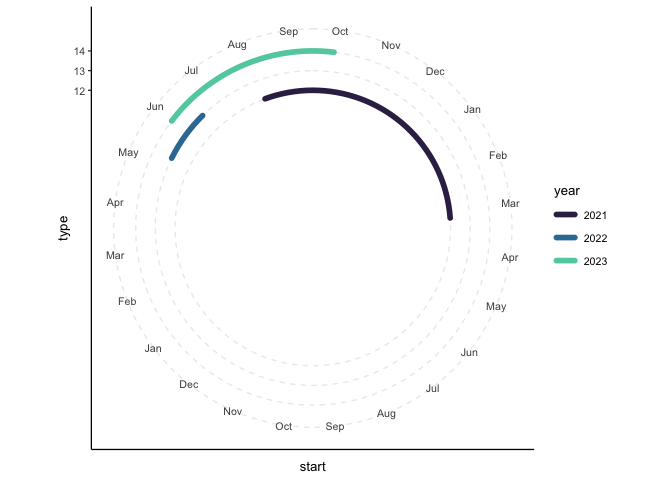

Make survey calendar figure
================
eleanorjackson
18 December, 2023

``` r
library("tidyverse")
library("here")
```

``` r
tibble(
  month = rep(1:12, 3),
  year = factor(c(rep(2021, 12),
           rep(2022, 12),
           rep(2023, 12)))
) -> data
```

``` r
ggplot(data, aes(x = as.factor(month), y = year, colour = year, group = year)) +
  geom_line() +
  coord_polar() 
```

<!-- -->

``` r
ggplot(data, aes(x = month, y = year, colour = year, group = year)) +
  geom_line() +
  coord_polar(start = -89.5) + 
  scale_x_continuous(expand = c(0, 0), limits = c(1,24), breaks = c(1:12)) 
```

<!-- -->

``` r
survey_dates <- tibble(
  year = factor(c(2022, 2022, 2023, 2023, 2021, 2021, 2023, 
                  2023, 2021, 2021, 2021, 2021)),
  month = factor(c(5, 6, 5, 6, 8, 9, 6, 9, 8, 12, 1, 3)),
  day = factor(c(9, 17, 31, 29, 5, 29, 26, 29, 5, 31, 1, 7)),
  type = factor(c("set", "set", "set", "set", "short_drop", 
                  "short_drop", "short_drop", "short_drop", 
                  "long_drop", "long_drop", "long_drop", "long_drop"))
) %>%
  mutate(date = as.Date(paste("2023", month, day, sep="-"),
                        format = "%Y-%m-%d"),
         type = paste(year, type)
                              )
```

``` r
ggplot(survey_dates, aes(x = date, y = type, colour = year, group = type)) +
  geom_line() +
  coord_polar() +
  scale_x_date(date_breaks = "1 month",  expand = c(0,0),
               date_labels = "%B")
```

<!-- -->

Trying `geom_segment` rather than `geom_line`:

``` r
survey_segs <- tibble(
  year = factor(c(2022, 2023, 2023, 2021, 2021, 2020)),
  start = as.Date(c("2023-05-09", "2023-05-31", "2023-06-26", "2023-08-05", 
                    "2023-01-01", "2023-01-01"), format = "%Y-%m-%d"),
  end = as.Date(c("2023-06-17", "2023-06-29", "2023-09-29", "2023-12-31", 
                  "2023-03-07", "2023-01-01"), format = "%Y-%m-%d"),
  type = factor(c("2022set", "2023set", "2023short_drop", "2021long_drop", 
                  "2021long_drop", "2020spare"))
)
```

``` r
ggplot(survey_segs, 
       aes(x = start, xend = end, y = type, yend = type, 
           colour = year, group = year)) +
  geom_segment() 
```

<!-- -->

``` r
ggplot(survey_segs, 
       aes(x = start, xend = end, y = type, yend = type, 
           colour = year, group = year)) +
  geom_segment(linewidth = 2, lineend = "round") +
  coord_polar(start = -89.5) +
  scale_x_date(date_breaks = "1 month",  expand = c(0,0),
               date_labels = "%b",
               limits = as.Date(c("2023-01-01", "2024-12-31"))) 
```

<!-- -->

``` r
survey_segs_2 <- tibble(
  year = factor(c(2022, 2023, 2023, 2021, 2021)),
  start = as.Date(c("2023-05-09", "2023-05-31", "2023-06-26", "2023-08-05", 
                    "2023-01-01"), format = "%Y-%m-%d"),
  end = as.Date(c("2023-06-17", "2023-06-29", "2023-09-29", "2023-12-31", 
                  "2023-03-07"), format = "%Y-%m-%d"),
  type = c(13, 14, 15, 12, 12))
```

``` r
ggplot(survey_segs_2, 
       aes(x = start, xend = end, y = type, yend = type, 
           colour = year, group = year)) +
  geom_segment(linewidth = 2, lineend = "round") +
  coord_polar(start = -89.5) +
  ylim(5, 15) +
  scale_x_date(date_breaks = "1 month",  expand = c(0,0),
               date_labels = "%b",
               limits = as.Date(c("2023-01-01", "2024-12-31"))) +
  scale_color_manual(values = c("#fde725", "#21918c", "#440154"))
```

<!-- -->

``` r
png(
  here::here("output", "figures", "survey_cal.png"),
  width = 1476,
  height = 1800,
  units = "px",
  type = "cairo"
)
ggplot(survey_segs_2, 
       aes(x = start, xend = end, y = type, yend = type, 
           colour = year, group = year)) +
  geom_segment(linewidth = 5, lineend = "round") +
  coord_polar(start = -89.5) +
  ylim(5, 15) +
  scale_x_date(date_breaks = "1 month",  expand = c(0,0),
               date_labels = "%b",
               limits = as.Date(c("2023-01-01", "2024-12-31"))) +
  scale_color_manual(values = c("#fde725", "#21918c", "#440154")) +
  theme_classic(base_size = 35)
dev.off()
```

Stock hawthorn images from
[here](https://stock.adobe.com/images/hawthorn-plant-graphic-black-white-isolated-sketch-illustration-vector/526493884)
