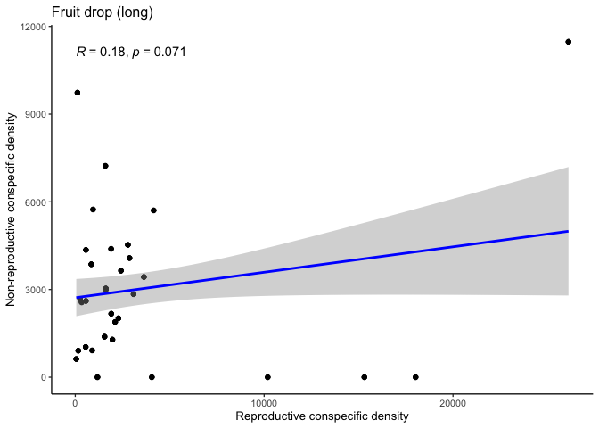
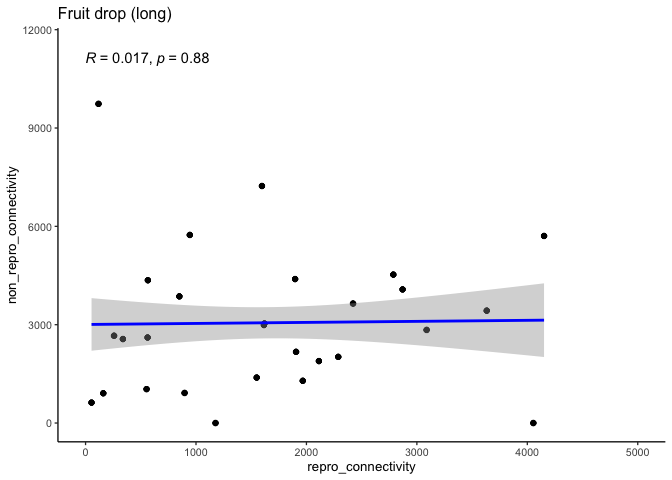
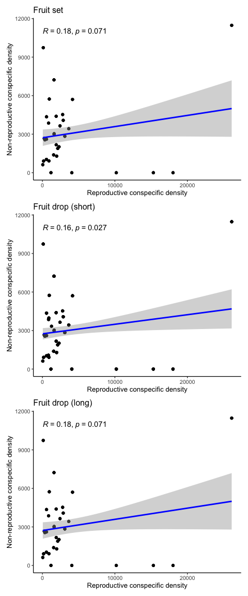

Conspecific density correlations?
================
eleanorjackson
27 February, 2024

``` r
library("tidyverse")
library("here")
library("ggpubr")
library("patchwork")
```

``` r
readRDS(here::here("data", "clean", "fruit_set_data.rds")) %>%
  ggplot(aes(x = repro_connectivity, y = non_repro_connectivity)) +
  geom_point() +
  ggpubr::stat_cor() +
  geom_smooth(method = "lm", 
              colour = "blue") +
  labs(title = "Fruit set",
       x = "Reproductive conspecific density", 
       y = "Non-reproductive conspecific density") -> p1

p1
```

    ## `geom_smooth()` using formula = 'y ~ x'

<!-- -->

without outliers:

``` r
readRDS(here::here("data", "clean", "fruit_set_data.rds")) %>%
  ggplot(aes(x = repro_connectivity, y = non_repro_connectivity)) +
  geom_point() +
  xlim(0, 5000) +
  ggpubr::stat_cor() +
  geom_smooth(method = "lm", 
              colour = "blue") +
  labs(title = "Fruit set") 
```

    ## Warning: Removed 15 rows containing non-finite values (`stat_cor()`).

    ## `geom_smooth()` using formula = 'y ~ x'

    ## Warning: Removed 15 rows containing non-finite values (`stat_smooth()`).

    ## Warning: Removed 15 rows containing missing values (`geom_point()`).

<!-- -->

``` r
readRDS(here::here("data", "clean", "fruit_drop_data_short.rds")) %>%
  ggplot(aes(x = repro_connectivity, y = non_repro_connectivity)) +
  geom_point() +
  ggpubr::stat_cor() +
  geom_smooth(method = "lm", 
              colour = "blue") +
  labs(title = "Fruit drop (short)",
       x = "Reproductive conspecific density", 
       y = "Non-reproductive conspecific density") -> p2

p2
```

    ## `geom_smooth()` using formula = 'y ~ x'

<!-- -->

without outliers:

``` r
readRDS(here::here("data", "clean", "fruit_drop_data_short.rds")) %>%
  ggplot(aes(x = repro_connectivity, y = non_repro_connectivity)) +
  geom_point() +
  xlim(0, 5000) +
  ggpubr::stat_cor() +
  geom_smooth(method = "lm", 
              colour = "blue") +
  labs(title = "Fruit drop (short)")
```

    ## Warning: Removed 26 rows containing non-finite values (`stat_cor()`).

    ## `geom_smooth()` using formula = 'y ~ x'

    ## Warning: Removed 26 rows containing non-finite values (`stat_smooth()`).

    ## Warning: Removed 26 rows containing missing values (`geom_point()`).

<!-- -->

``` r
readRDS(here::here("data", "clean", "fruit_drop_data.rds")) %>%
  ggplot(aes(x = repro_connectivity, y = non_repro_connectivity)) +
  geom_point() +
  ggpubr::stat_cor() +
  geom_smooth(method = "lm", 
              colour = "blue") +
  labs(title = "Fruit drop (long)",
       x = "Reproductive conspecific density", 
       y = "Non-reproductive conspecific density") -> p3

p3
```

    ## `geom_smooth()` using formula = 'y ~ x'

<!-- -->

without outliers:

``` r
readRDS(here::here("data", "clean", "fruit_drop_data.rds")) %>%
  ggplot(aes(x = repro_connectivity, y = non_repro_connectivity)) +
  geom_point() +
  xlim(0, 5000) +
  ggpubr::stat_cor() +
  geom_smooth(method = "lm", 
              colour = "blue") +
  labs(title = "Fruit drop (long)")
```

    ## Warning: Removed 12 rows containing non-finite values (`stat_cor()`).

    ## `geom_smooth()` using formula = 'y ~ x'

    ## Warning: Removed 12 rows containing non-finite values (`stat_smooth()`).

    ## Warning: Removed 12 rows containing missing values (`geom_point()`).

<!-- -->

Correlation coefficients of less than 0.2 are usually classed as “very
weak to no correlation”.

``` r
p1 + p2 + p3 &
  theme_classic(base_size = 15)
```

    ## `geom_smooth()` using formula = 'y ~ x'
    ## `geom_smooth()` using formula = 'y ~ x'
    ## `geom_smooth()` using formula = 'y ~ x'

<!-- -->
