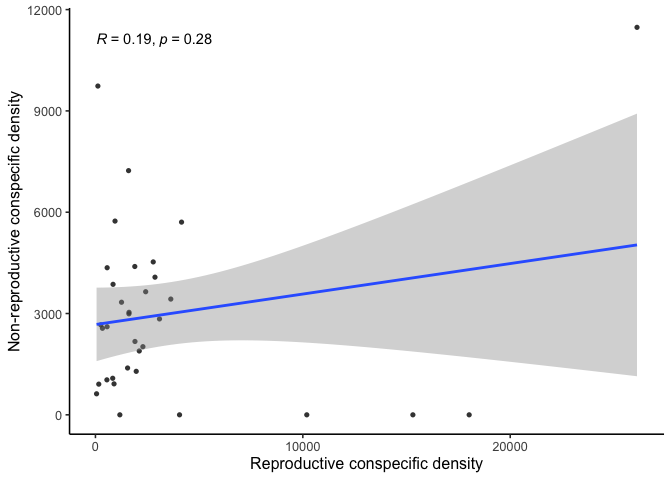
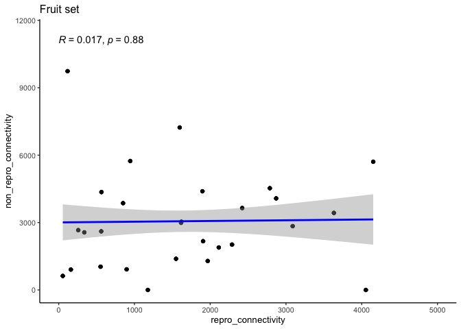
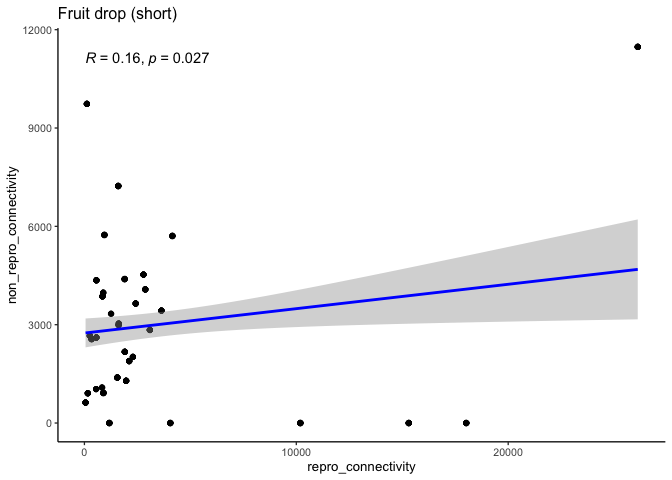
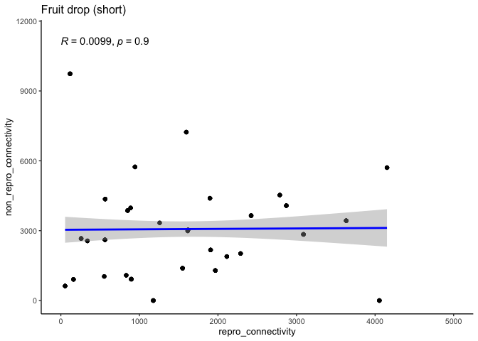

Conspecific density correlations?
================
eleanorjackson
05 September, 2024

``` r
library("tidyverse")
library("here")
library("ggpubr")
library("patchwork")

pal <- viridisLite::viridis(n = 3, begin = 0.2, end = 0.8, option = "mako")
names(pal) <- c("2021", "2022", "2023")
```

``` r
readRDS(here::here("data", "clean", "fruit_set_data.rds")) %>%
  ggplot(aes(x = repro_connectivity, y = non_repro_connectivity,
             colour = year)) +
  geom_point(show.legend = TRUE) +
  ggpubr::stat_cor(show.legend = FALSE) +
  geom_smooth(method = "lm",show.legend = TRUE) +
  scale_colour_manual(values = pal, drop = FALSE,
                      limits = names(pal)) +
  labs(title = "Fruit set",
       x = "Reproductive conspecific density", 
       y = "Non-reproductive conspecific density") +
  guides(colour = guide_legend("Year")) +
  coord_cartesian(ylim = c(0, 12000)) -> p1

p1
```

    ## `geom_smooth()` using formula = 'y ~ x'

<!-- -->

``` r
readRDS(here::here("data", "clean", "fruit_drop_early.rds")) %>%
  ggplot(aes(x = repro_connectivity, y = non_repro_connectivity,
             colour = year)) +
  geom_point(show.legend = TRUE) +
  ggpubr::stat_cor(show.legend = FALSE) +
  geom_smooth(method = "lm",show.legend = TRUE) +
  scale_colour_manual(values = pal, drop = FALSE,
                      limits = names(pal)) +
  labs(title = "Early fruit drop",
       x = "Reproductive conspecific density", 
       y = "Non-reproductive conspecific density") +
  guides(colour = guide_legend("Year")) +
  coord_cartesian(ylim = c(0, 12000)) -> p2

p2
```

    ## `geom_smooth()` using formula = 'y ~ x'

<!-- -->

``` r
readRDS(here::here("data", "clean", "fruit_drop_late.rds")) %>%
  ggplot(aes(x = repro_connectivity, y = non_repro_connectivity,
             colour = year)) +
  geom_point(show.legend = TRUE) +
  ggpubr::stat_cor(show.legend = FALSE) +
  geom_smooth(method = "lm",show.legend = TRUE) +
  scale_colour_manual(values = pal, drop = FALSE,
                      limits = names(pal)) +
  labs(title = "Late fruit drop",
       x = "Reproductive conspecific density", 
       y = "Non-reproductive conspecific density") +
  guides(colour = guide_legend("Year")) +
  coord_cartesian(ylim = c(0, 12000)) -> p3

p3
```

    ## `geom_smooth()` using formula = 'y ~ x'

<!-- -->

Correlation coefficients of less than 0.2 are usually classed as “very
weak to no correlation”.

``` r
p1 + p2 + p3 +
  plot_layout(guides = "collect") &
  theme_classic(base_size = 15) &
  theme(legend.position = "right",
        legend.justification = "top") 
```

    ## `geom_smooth()` using formula = 'y ~ x'
    ## `geom_smooth()` using formula = 'y ~ x'
    ## `geom_smooth()` using formula = 'y ~ x'

<!-- -->
