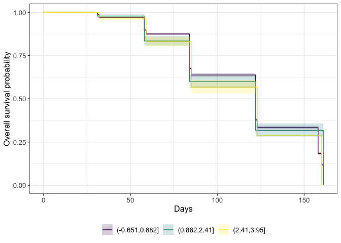
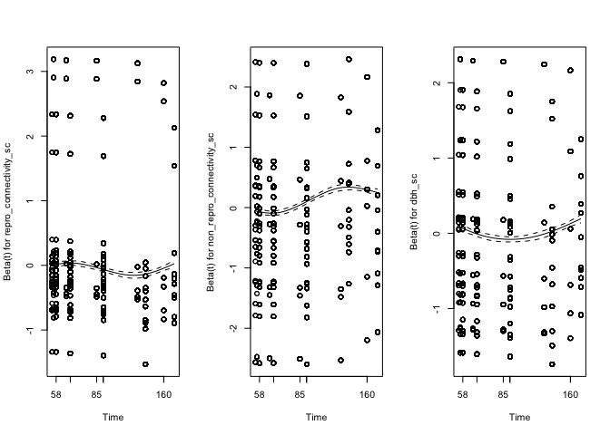

Survival analysis for hawthorn dispersal
================
eleanorjackson
20 June, 2024

``` r
library("ggsurvfit")
library("tidyverse")
library("here")
library("lubridate")
library("brms")
library("bayestestR")
library("rstanarm")
library("survival")
library("coxme")
```

Need to reformat data into typical “survival data” format with one row
for each fruit and time point which indicates whether it was on the
tree`0` or dropped `1`.

``` r
fruit_counts_21_22 <- 
  read.csv(here::here("data", "raw", "fruit_drop_data.csv"), 
           header = TRUE, na.strings = c("", "NA"))

fruit_counts_21_22 %>%
  mutate(date = dmy(date), branch = str_sub(branch_id, -1)) %>%
  mutate(branch = tolower(branch)) %>%
  mutate(branch_id = paste0(tree_id, branch)) %>%
  mutate(survey = case_when(
    date == "2022-03-04" | date == "2022-03-06" | date == "2022-03-07" ~ 8,
    date == "2022-01-28" | date == "2022-01-27" ~ 7,
    date == "2021-12-21" | date == "2021-12-20" ~ 6,
    date == "2021-11-25" | date == "2021-11-24" ~ 5,
    date == "2021-10-29" | date == "2021-10-28" ~ 4,
    date == "2021-09-29" | date == "2021-09-28" | date == "2021-09-27" ~ 3,
    date == "2021-09-02" ~ 2,
    date == "2021-08-06" | date == "2021-08-05" ~ 1,
  )) %>%
  mutate(exclusion = ifelse(branch == "d" | branch == "e" | branch == "f",
                            FALSE, TRUE)) %>%
  group_by(branch_id) %>%
  reframe(across(everything()),
            length_cm = median(length_cm, na.rm = TRUE)) %>%
  select(- notes) -> survey_data_21_22

# exclusion cages were added on survey 3 and counted on these
# branches for the first time
```

``` r
survey_data_21_22 %>% 
  filter(exclusion == FALSE) %>% 
  filter(survey >2) %>% 
  group_by(branch_id) %>% 
  mutate(total_fruit = max(n_fruit)) %>% 
  ungroup() -> survival_data
```

``` r
survival_data %>% 
  ggplot(aes(y = n_fruit/total_fruit, 
           x = survey, 
           group = branch_id, 
           colour = branch_id)) +
  geom_point() +
  geom_path() +
  facet_wrap(~tree_id) +
  theme(legend.position = "none")
```

<!-- -->

``` r
survival_data %>% 
  group_by(branch_id) %>% 
  mutate(days = as.numeric(
    difftime(date, 
             "2021-09-27", 
             unit = "day")
    ) ) %>% 
  ggplot(aes(y = n_fruit/total_fruit, 
           x = days, 
           group = branch_id, 
           colour = branch_id)) +
  geom_point() +
  geom_path() +
  facet_wrap(~tree_id) +
  theme(legend.position = "none")
```

<!-- -->

``` r
survival_data %>% 
  mutate(n_dropped = total_fruit - n_fruit) %>% 
  uncount(n_dropped) %>% 
  mutate(status = 1) -> dead_counts

survival_data %>% 
  uncount(n_fruit) %>% 
  mutate(status = 0) -> alive_counts

bind_rows(dead_counts, alive_counts) -> long_data
```

``` r
readRDS(here::here("data", "clean", "fruit_dispersal.rds")) %>%
  select(branch_id, 
         repro_connectivity, 
         non_repro_connectivity, 
         dbh) %>% 
  right_join(long_data, by = "branch_id") %>% 
  mutate(repro_connectivity_sc = scale(repro_connectivity),
         non_repro_connectivity_sc = scale(non_repro_connectivity),
         dbh_sc = scale(dbh),
         tree_id = as.factor(tree_id),
         exclusion = as.factor(exclusion)
  ) %>% 
  mutate(days = as.numeric(
    difftime(date, 
             "2021-09-27", 
             unit = "day")
    ) ) %>% 
  mutate(days = round(days),
         survey = survey -3) -> survival_data_sc
```

# survival package

following along from here:
<https://www.emilyzabor.com/tutorials/survival_analysis_in_r_tutorial.html>

``` r
Surv(survival_data_sc$days, survival_data_sc$status)[1:10]
```

    ##  [1] 31 31 31 58 58 58 58 58 58 58

``` r
s1 <- survfit(Surv(days, status) ~ 1, data = survival_data_sc)
glimpse(s1)
```

    ## List of 16
    ##  $ n        : int 18956
    ##  $ time     : num [1:14] 0 1 2 31 32 58 59 84 85 122 ...
    ##  $ n.risk   : num [1:14] 18956 18079 17287 15774 13897 ...
    ##  $ n.event  : num [1:14] 0 0 2 173 257 ...
    ##  $ n.censor : num [1:14] 877 792 1511 1704 1048 ...
    ##  $ surv     : num [1:14] 1 1 1 0.989 0.971 ...
    ##  $ std.err  : num [1:14] 0.00 0.00 8.18e-05 8.42e-04 1.44e-03 ...
    ##  $ cumhaz   : num [1:14] 0 0 0.000116 0.011083 0.029576 ...
    ##  $ std.chaz : num [1:14] 0.00 0.00 8.18e-05 8.38e-04 1.43e-03 ...
    ##  $ type     : chr "right"
    ##  $ logse    : logi TRUE
    ##  $ conf.int : num 0.95
    ##  $ conf.type: chr "log"
    ##  $ lower    : num [1:14] 1 1 1 0.987 0.968 ...
    ##  $ upper    : num [1:14] 1 1 1 0.991 0.973 ...
    ##  $ call     : language survfit(formula = Surv(days, status) ~ 1, data = survival_data_sc)
    ##  - attr(*, "class")= chr "survfit"

## Kaplan-Meier plots

``` r
ggsurvfit::survfit2(Surv(days, status) ~ 1, data = survival_data_sc) %>% 
  ggsurvfit() +
  labs(
    x = "Days",
    y = "Overall survival probability"
  ) + 
  add_confidence_interval()
```

<!-- -->

The confidence interval is very narrow and hard to see.

Can we tease anything out of this? Try colouring by tree id:

``` r
pal_29<-viridisLite::viridis(n = 29, option = "mako")

ggsurvfit::survfit2(
  Surv(days, status) ~ 
    repro_connectivity_sc, data = survival_data_sc) %>% 
  ggsurvfit() +
  scale_color_manual(values = pal_29) +
  scale_fill_manual(values = pal_29) +
  labs(
    x = "Days",
    y = "Overall survival probability"
  ) + 
  #add_confidence_interval() +
  theme(legend.position = "none") 
```

<!-- -->

Maybe we can turn the predictor variables into categories (high, medium,
low) to look for patterns in how they might influence the relationship
between survival & time.

### reproductive conspecific density

``` r
ggplot(survival_data_sc, aes(repro_connectivity_sc)) + 
  geom_histogram(bins=20)
```

<!-- -->

``` r
data_repro_split <-survival_data_sc %>% 
  mutate(conect_cat = cut(repro_connectivity_sc, breaks= 3)) 

ggsurvfit::survfit2(Surv(days, status) ~ conect_cat,
                    data = data_repro_split) %>% 
  ggsurvfit() +
  labs(
    x = "Days",
    y = "Overall survival probability"
  ) + 
  add_confidence_interval() +
  scale_colour_viridis_d() +
  scale_fill_viridis_d()
```

<!-- -->

### non-reproductive conspecific density

``` r
ggplot(survival_data_sc, aes(non_repro_connectivity_sc)) + 
  geom_histogram(bins=20)
```

<!-- -->

``` r
data_repro_split <-survival_data_sc %>% 
  mutate(conect_cat = cut(non_repro_connectivity_sc, breaks= 3)) 

ggsurvfit::survfit2(Surv(days, status) ~ conect_cat,
                    data = data_repro_split) %>% 
  ggsurvfit() +
  labs(
    x = "Days",
    y = "Overall survival probability"
  ) + 
  add_confidence_interval() +
  scale_colour_viridis_d() +
  scale_fill_viridis_d()
```

<!-- -->
\### DBH

``` r
ggplot(survival_data_sc, aes(dbh_sc)) + 
  geom_histogram(bins=20)
```

<!-- -->

``` r
data_repro_split <- survival_data_sc %>% 
  mutate(conect_cat = cut(dbh_sc, breaks= 3)) 

ggsurvfit::survfit2(Surv(days, status) ~ conect_cat,
                    data = data_repro_split) %>% 
  ggsurvfit() +
  labs(
    x = "Days",
    y = "Overall survival probability"
  ) + 
  add_confidence_interval() +
  scale_colour_viridis_d() +
  scale_fill_viridis_d()
```

<!-- -->

## Cox

I don’t think we can have random effects with the `coxph` function.

``` r
coxph_mod <- coxph(Surv(days, status) ~ 
                     repro_connectivity_sc +
                     non_repro_connectivity_sc +
                     dbh_sc, 
                   data = survival_data_sc) 

coxph_mod
```

    ## Call:
    ## coxph(formula = Surv(days, status) ~ repro_connectivity_sc + 
    ##     non_repro_connectivity_sc + dbh_sc, data = survival_data_sc)
    ## 
    ##                               coef exp(coef) se(coef)      z        p
    ## repro_connectivity_sc     -0.02652   0.97383  0.01018 -2.605   0.0092
    ## non_repro_connectivity_sc  0.05208   1.05346  0.01088  4.787 1.69e-06
    ## dbh_sc                     0.02462   1.02492  0.01077  2.286   0.0223
    ## 
    ## Likelihood ratio test=27.24  on 3 df, p=5.231e-06
    ## n= 18956, number of events= 10255

`coxme` package will allow us to add random effects.

``` r
coxme_mod <- coxme(Surv(days, status) ~ 
                     repro_connectivity_sc +
                     non_repro_connectivity_sc +
                     dbh_sc + (1|tree_id), 
                   data = survival_data_sc) 

coxme_mod
```

    ## Cox mixed-effects model fit by maximum likelihood
    ##   Data: survival_data_sc
    ##   events, n = 10255, 18956
    ##   Iterations= 16 68 
    ##                     NULL Integrated    Fitted
    ## Log-likelihood -85411.72  -84987.92 -84924.25
    ## 
    ##                    Chisq    df p    AIC    BIC
    ## Integrated loglik 847.60  4.00 0 839.60 810.66
    ##  Penalized loglik 974.95 27.14 0 920.68 724.34
    ## 
    ## Model:  Surv(days, status) ~ repro_connectivity_sc + non_repro_connectivity_sc +      dbh_sc + (1 | tree_id) 
    ## Fixed coefficients
    ##                                  coef exp(coef)   se(coef)     z    p
    ## repro_connectivity_sc     -0.03151726 0.9689742 0.06589073 -0.48 0.63
    ## non_repro_connectivity_sc  0.10137724 1.1066941 0.07288241  1.39 0.16
    ## dbh_sc                     0.01798290 1.0181456 0.07267605  0.25 0.80
    ## 
    ## Random effects
    ##  Group   Variable  Std Dev   Variance 
    ##  tree_id Intercept 0.3564132 0.1270304

One assumption of the Cox proportional hazards regression model is that
the hazards are proportional at each point in time throughout follow-up.
The `cox.zph()` function from the {survival} package allows us to check
this assumption. It results in two main things:

- A hypothesis test of whether the effect of each covariate differs
  according to time, and a global test of all covariates at once.
  - This is done by testing for an interaction effect between the
    covariate and log(time)
  - A significant p-value indicates that the proportional hazards
    assumption is violated
- Plots of the Schoenfeld residuals
  - Deviation from a zero-slope line is evidence that the proportional
    hazards assumption is violated

``` r
cox.zph(coxme_mod)
```

    ##                              chisq df      p
    ## repro_connectivity_sc       0.1577  1   0.69
    ## non_repro_connectivity_sc 175.5841  1 <2e-16
    ## dbh_sc                      0.0369  1   0.85
    ## GLOBAL                    195.3724  3 <2e-16

``` r
par(mfrow=c(1,3))
cox.zph(coxme_mod) %>% 
  plot() 
```

<!-- -->

The proportional hazards assumption is not satisfied for the model
overall (p \<0.05 for `GLOBAL`).

To relax the PH assumptions we can add an interaction between the
predictor and time. So we are assuming the effect of non-reproductive
conspecific density varies linearly with time..

``` r
coxme_mod_2 <- coxme(Surv(days, status) ~ 
                     repro_connectivity_sc +
                     non_repro_connectivity_sc +
                     (non_repro_connectivity_sc:days) +
                     dbh_sc + (1|tree_id), 
                   data = survival_data_sc) 

coxme_mod_2
```

    ## Cox mixed-effects model fit by maximum likelihood
    ##   Data: survival_data_sc
    ##   events, n = 10255, 18956
    ##   Iterations= 18 94 
    ##                     NULL Integrated    Fitted
    ## Log-likelihood -85411.72  -84923.14 -84860.31
    ## 
    ##                     Chisq    df p     AIC    BIC
    ## Integrated loglik  977.16  5.00 0  967.16 930.98
    ##  Penalized loglik 1102.82 28.08 0 1046.65 843.45
    ## 
    ## Model:  Surv(days, status) ~ repro_connectivity_sc + non_repro_connectivity_sc +      (non_repro_connectivity_sc:days) + dbh_sc + (1 | tree_id) 
    ## Fixed coefficients
    ##                                        coef exp(coef)     se(coef)     z
    ## repro_connectivity_sc          -0.028674446 0.9717328 0.0640142394 -0.45
    ## non_repro_connectivity_sc      -0.464307893 0.6285700 0.0873095858 -5.32
    ## dbh_sc                          0.023071635 1.0233398 0.0706151104  0.33
    ## non_repro_connectivity_sc:days  0.004084467 1.0040928 0.0003671087 11.13
    ##                                      p
    ## repro_connectivity_sc          6.5e-01
    ## non_repro_connectivity_sc      1.0e-07
    ## dbh_sc                         7.4e-01
    ## non_repro_connectivity_sc:days 0.0e+00
    ## 
    ## Random effects
    ##  Group   Variable  Std Dev   Variance 
    ##  tree_id Intercept 0.3459609 0.1196890

``` r
cox.zph(coxme_mod_2)
```

    ##                                 chisq df       p
    ## repro_connectivity_sc            1.18  1    0.28
    ## non_repro_connectivity_sc       77.34  1 < 2e-16
    ## dbh_sc                           4.70  1    0.03
    ## non_repro_connectivity_sc:days  55.63  1 8.7e-14
    ## GLOBAL                         226.19  4 < 2e-16

``` r
par(mfrow=c(2,3))
cox.zph(coxme_mod_2) %>% 
  plot() 
```

<!-- -->

# Bayes

``` r
bprior <- c(prior(normal(0, 1), class = b))
```

## Cox

``` r
options(brms.file_refit = "on_change")

dispersal_mod_cox <-
  brm(data = survival_data_sc,
      family = cox(link = "log", bhaz = NULL),
      days| cens(1-status) ~
        repro_connectivity_sc +
        non_repro_connectivity_sc +
        dbh_sc +
        (1|tree_id),
      prior = bprior,
      iter = 2000,
      warmup = 1000,
      chains = 4,
      cores = 4,
      seed = 9,
      file = (here::here("output", "models", "survival_fit.rds")))

dispersal_mod_cox
```

    ##  Family: cox 
    ##   Links: mu = log 
    ## Formula: days | cens(1 - status) ~ repro_connectivity_sc + non_repro_connectivity_sc + dbh_sc + (1 | tree_id) 
    ##    Data: survival_data_sc (Number of observations: 18956) 
    ##   Draws: 4 chains, each with iter = 2000; warmup = 1000; thin = 1;
    ##          total post-warmup draws = 4000
    ## 
    ## Multilevel Hyperparameters:
    ## ~tree_id (Number of levels: 29) 
    ##               Estimate Est.Error l-95% CI u-95% CI Rhat Bulk_ESS Tail_ESS
    ## sd(Intercept)     0.19      0.04     0.14     0.28 1.00     1066     1996
    ## 
    ## Regression Coefficients:
    ##                           Estimate Est.Error l-95% CI u-95% CI Rhat Bulk_ESS
    ## Intercept                     0.89      0.04     0.80     0.97 1.01     1105
    ## repro_connectivity_sc         0.03      0.04    -0.04     0.11 1.00     1774
    ## non_repro_connectivity_sc    -0.02      0.04    -0.10     0.06 1.00     1527
    ## dbh_sc                       -0.02      0.04    -0.10     0.07 1.00     1541
    ##                           Tail_ESS
    ## Intercept                     1699
    ## repro_connectivity_sc         2162
    ## non_repro_connectivity_sc     1843
    ## dbh_sc                        1736
    ## 
    ## Draws were sampled using sampling(NUTS). For each parameter, Bulk_ESS
    ## and Tail_ESS are effective sample size measures, and Rhat is the potential
    ## scale reduction factor on split chains (at convergence, Rhat = 1).

The coefficients are very similar to our frequentist `coxme_mod` model -
a good sign! - but only when using flat priors.

It seems there isn’t any way to sample from the posterior for cox models
(see issue [here).](https://github.com/paul-buerkner/brms/issues/966)

Might be able to do it following steps
[here](https://discourse.mc-stan.org/t/manual-absolute-predictions-from-cox-model-in-brms/27966/8)

``` r
bhaz <- basehaz(coxph(Surv(days, status) ~ 1, data = survival_data_sc))
```

This gives predictions of survival at 59 days for an average tree:

``` r
exp(-bhaz$hazard[bhaz$time == 59] * 
      exp(TRUE * as_draws_df(dispersal_mod_cox)$sd_tree_id__Intercept)) |> 
  quantile(probs = c(0.025, 0.5, 0.975))
```

    ##      2.5%       50%     97.5% 
    ## 0.8312437 0.8439148 0.8512063

``` r
tidybayes::tidy_draws(dispersal_mod_cox) %>%
  rename(
    `Diameter at\nbreast height` = b_dbh_sc,
    `Reproductive\nconspecific density` = b_repro_connectivity_sc,
    `Non-reproductive\nconspecific density` = b_non_repro_connectivity_sc
  ) %>%
  select(
    `Reproductive\nconspecific density`,
    `Non-reproductive\nconspecific density`,
    `Diameter at\nbreast height`
  ) %>%
  pivot_longer(cols = everything(), names_to = "parameter") %>%
  ggplot(aes(x = value,
             y = parameter
             )) +
  ggdist::stat_halfeye() +
  geom_vline(xintercept = 0,
             linetype = 2,
             linewidth = 1) +
  labs(x = "Parameter value", y = "") +
  theme(legend.position = "none")
```

<!-- -->

## Weibull

``` r
dispersal_mod_weibull <-
  brm(data = survival_data_sc,
      family = weibull(link = "log", link_shape = "log"),
      survey| cens(1-status) ~
        repro_connectivity_sc +
        non_repro_connectivity_sc +
        dbh_sc +
        (1|tree_id),
      prior = bprior,
      iter = 2000,
      warmup = 1000,
      chains = 4,
      cores = 4,
      seed = 9)
```

``` r
pp_check(dispersal_mod_weibull, 
         ndraws = 50, 
         type = "km_overlay", 
         status_y = survival_data_sc$status)
```

Notes on Weibull parameters: For anyone else interested, I believe the
following produces the correct survival function for the Weibull
distribution, as parameterized in brms. We need parameters lamba and k
(the shape parameter estimated in brms). The following R code converts
the mean value to lambda:

lambda = exp(mu) / gamma( 1 + 1/k )

Survival at time t is then:

exp( - (t / lambda)^k )

## Log-normal

``` r
dispersal_mod_lognormal <-
  brm(data = survival_data_sc,
      family = lognormal(link = "identity", link_sigma = "log"),
      days| cens(1-status) ~
        repro_connectivity_sc +
        non_repro_connectivity_sc +
        dbh_sc +
        (1|tree_id),
      prior = bprior,
      iter = 2000,
      warmup = 1000,
      chains = 4,
      cores = 4,
      seed = 9)
```

Notes on Lognormal parameters:
<https://discourse.mc-stan.org/t/understanding-shifted-lognormal-parameters-and-priors/13519/3>
plotting the survival curve:
<https://discourse.mc-stan.org/t/plotting-survival-plots-after-brm/14226>

``` r
pp_check(dispersal_mod_lognormal, 
         ndraws = 50, 
         type = "km_overlay", 
         status_y = survival_data_sc$status)
```

## Gamma

``` r
dispersal_mod_Gamma <-
  brm(data = survival_data_sc,
      family = Gamma(link = "log"),
      survey| cens(1-status) ~
        repro_connectivity_sc +
        non_repro_connectivity_sc +
        dbh_sc +
        (1|tree_id),
      prior = bprior,
      iter = 2000,
      warmup = 1000,
      chains = 4,
      cores = 4,
      seed = 9)

pp_check(dispersal_mod_Gamma)
```

``` r
pp_check(dispersal_mod_Gamma, 
         ndraws = 50, 
         type = "km_overlay", 
         status_y = survival_data_sc$status)
```

## Compare models

``` r
loo_compare(waic(dispersal_mod_Gamma), 
            waic(dispersal_mod_lognormal), 
            waic(dispersal_mod_weibull), 
            waic(dispersal_mod_cox))
```

# preds for log normal

``` r
survival_data_sc %>%
  modelr::data_grid(
    non_repro_connectivity_sc = modelr::seq_range(non_repro_connectivity_sc, n = 5),
    repro_connectivity_sc = modelr::seq_range(repro_connectivity_sc, n = 5),
    dbh_sc = modelr::seq_range(dbh_sc, n = 5),
    survey = modelr::seq_range(survey, n = 5)
  ) %>%
  tidybayes::add_epred_draws(dispersal_mod_lognormal, ndraws = 500, re_formula = NA,
                             status_y = survival_data_sc$status) -> surv_pred

rstanarm::posterior_survfit(object = dispersal_mod_lognormal) |>
  glimpse()

surv_pred |>
  ggplot(aes(x = repro_connectivity_sc)) +
  ggdist::stat_lineribbon(
    aes(y = .epred )) 

surv_pred |>
  ggplot(aes(x = survey)) +
  ggdist::stat_lineribbon(
    aes(y = .epred )) 
```

# test with simulated data

<https://github.com/anddis/brms-weibullPH/tree/main>

``` r
simdata <- local({
  set.seed(1901)
  N <- 1000
  x <- rbinom(N, 1, 0.5)
  z <- rnorm(N)
  y <- flexsurv::rweibullPH(N, 
                            shape =  1.2, # gamma
                            scale = exp(0 + log(2)*x + log(0.75)*z)) # mu
  cens <- runif(N, 0, 4)
  time <- pmin(y, cens)
  status <- as.numeric(y <= cens)
  data.frame(
    time = time,
    status = status,
    censored = 1 - status,
    x = factor(x),
    z = z
  )
})
```

``` r
simdata %>% 
  group_by(time) %>% 
  count(status) %>% 
  pivot_wider(names_from = status, values_from = n) %>% 
  mutate(`0` = replace_na(`0`, 0),
         `1` = replace_na(`1`, 0),)%>% 
  rename(alive = `1`, dead = `0`) %>% 
  group_by(time) %>%
  summarise(total = n()) %>% glimpse
  ggplot(aes(x = time, y = dead/(dead + alive))) +
  geom_point()
```

``` r
test_lognormal <-
  brm(data = simdata,
      family = lognormal(link = "identity", link_sigma = "log"),
      time| cens(censored) ~
        x + z ,
      prior = bprior,
      iter = 2000,
      warmup = 1000,
      chains = 4,
      cores = 4,
      seed = 9)
```

``` r
pp_check(test_lognormal, 
         ndraws = 50, 
         type = "km_overlay", 
         status_y = simdata$status)
```
