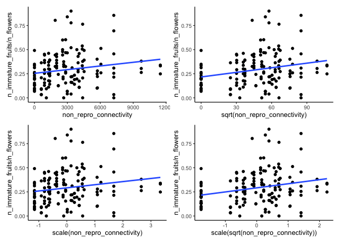
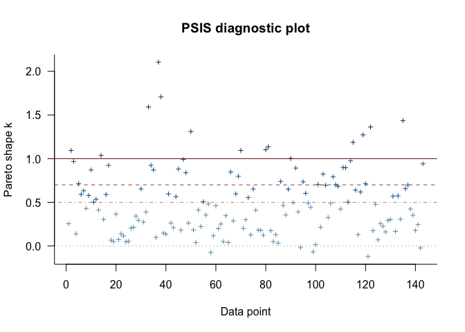
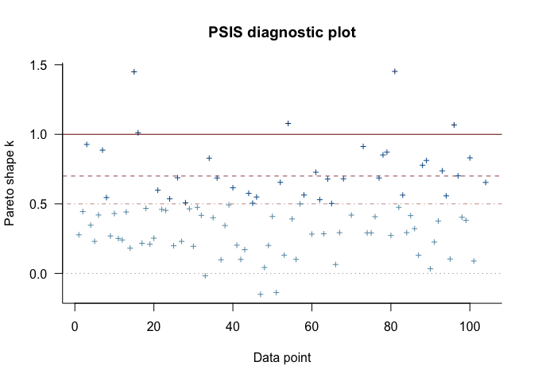
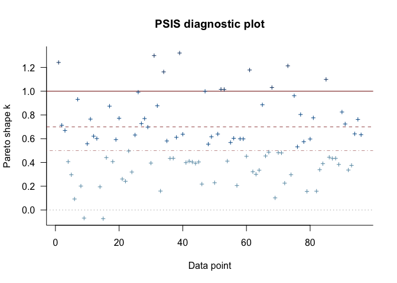
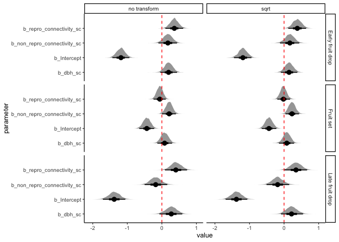

Response to reviewer \#1, comment \#2
================
eleanorjackson
21 February, 2025

``` r
library("tidyverse")
```

    ## ── Attaching core tidyverse packages ──────────────────────── tidyverse 2.0.0 ──
    ## ✔ dplyr     1.1.2     ✔ readr     2.1.4
    ## ✔ forcats   1.0.0     ✔ stringr   1.5.0
    ## ✔ ggplot2   3.5.1     ✔ tibble    3.2.1
    ## ✔ lubridate 1.9.2     ✔ tidyr     1.3.0
    ## ✔ purrr     1.0.1     
    ## ── Conflicts ────────────────────────────────────────── tidyverse_conflicts() ──
    ## ✖ dplyr::filter() masks stats::filter()
    ## ✖ dplyr::lag()    masks stats::lag()
    ## ℹ Use the conflicted package (<http://conflicted.r-lib.org/>) to force all conflicts to become errors

``` r
library("here")
```

    ## here() starts at /Users/eleanorjackson/Library/CloudStorage/OneDrive-Nexus365/wytham-hawthorn

``` r
library("brms")
```

    ## Loading required package: Rcpp
    ## Loading 'brms' package (version 2.21.5). Useful instructions
    ## can be found by typing help('brms'). A more detailed introduction
    ## to the package is available through vignette('brms_overview').
    ## 
    ## Attaching package: 'brms'
    ## 
    ## The following object is masked from 'package:stats':
    ## 
    ##     ar

``` r
library("bayestestR")
library("tidybayes")
```

    ## 
    ## Attaching package: 'tidybayes'
    ## 
    ## The following object is masked from 'package:bayestestR':
    ## 
    ##     hdi
    ## 
    ## The following objects are masked from 'package:brms':
    ## 
    ##     dstudent_t, pstudent_t, qstudent_t, rstudent_t

``` r
library("ggdist")
```

    ## 
    ## Attaching package: 'ggdist'
    ## 
    ## The following object is masked from 'package:bayestestR':
    ## 
    ##     hdi
    ## 
    ## The following objects are masked from 'package:brms':
    ## 
    ##     dstudent_t, pstudent_t, qstudent_t, rstudent_t

``` r
library("ggblend")
library("patchwork")
library("viridisLite")
library("modelr")

set.seed(123)
options(brms.file_refit = "on_change")
```

``` r
readRDS(here::here("data", "clean", "fruit_set_data.rds")) %>%
  mutate(repro_connectivity_sqrt = sqrt(repro_connectivity),
         non_repro_connectivity_sqrt = sqrt(non_repro_connectivity)) %>% 
  mutate(repro_connectivity_sc = scale(sqrt(repro_connectivity)),
         non_repro_connectivity_sc = scale(sqrt(non_repro_connectivity)),
         dbh_sc = scale(dbh),
         tree_id = as.factor(tree_id),
         year = as.factor(year)
  ) -> fruit_set_data

readRDS(here::here("data", "clean", "fruit_drop_early.rds")) %>%
  mutate(repro_connectivity_sqrt = sqrt(repro_connectivity),
         non_repro_connectivity_sqrt = sqrt(non_repro_connectivity)) %>% 
  mutate(repro_connectivity_sc = scale(sqrt(repro_connectivity)),
         non_repro_connectivity_sc = scale(sqrt(non_repro_connectivity)),
         dbh_sc = scale(dbh),
         tree_id = as.factor(tree_id)
           ) -> early_drop_data

readRDS(here::here("data", "clean", "fruit_drop_late.rds")) %>%
  mutate(repro_connectivity_sqrt = sqrt(repro_connectivity),
         non_repro_connectivity_sqrt = sqrt(non_repro_connectivity)) %>% 
  mutate(repro_connectivity_sc = scale(sqrt(repro_connectivity)),
         non_repro_connectivity_sc = scale(sqrt(non_repro_connectivity)),
         dbh_sc = scale(dbh),
         tree_id = as.factor(tree_id)
  ) -> late_drop_data
```

``` r
fruit_set_data %>% 
  ggplot(aes(x = non_repro_connectivity, y = n_immature_fruits/n_flowers)) +
  geom_point() +
  geom_smooth(se=FALSE, method = "glm") +
  
  fruit_set_data %>% 
  ggplot(aes(x = sqrt(non_repro_connectivity), y = n_immature_fruits/n_flowers)) +
  geom_point() +
  geom_smooth(se=FALSE, method = "glm") +
  
  fruit_set_data %>% 
  ggplot(aes(x = scale(non_repro_connectivity), y = n_immature_fruits/n_flowers)) +
  geom_point() +
  geom_smooth(se=FALSE, method = "glm") +

  fruit_set_data %>% 
  ggplot(aes(x = scale(sqrt(non_repro_connectivity)), y = n_immature_fruits/n_flowers)) +
  geom_point() +
  geom_smooth(se=FALSE, method = "glm")
```

    ## `geom_smooth()` using formula = 'y ~ x'
    ## `geom_smooth()` using formula = 'y ~ x'
    ## `geom_smooth()` using formula = 'y ~ x'
    ## `geom_smooth()` using formula = 'y ~ x'

<!-- -->

``` r
file_names <- as.list(dir(path = here::here("output", "models"),
                          pattern = "*.rds", full.names = TRUE))

model_list <- lapply(file_names, readRDS)

names(model_list) <- lapply(file_names, basename)
```

``` r
plot(loo(model_list$fruit_set_fit.rds))
```

    ## Warning: Found 37 observations with a pareto_k > 0.7 in model
    ## 'model_list$fruit_set_fit.rds'. We recommend to set 'moment_match = TRUE' in
    ## order to perform moment matching for problematic observations.

<!-- -->

``` r
plot(loo(model_list$early_drop_fit.rds))
```

    ## Warning: Found 23 observations with a pareto_k > 0.7 in model
    ## 'model_list$early_drop_fit.rds'. We recommend to set 'moment_match = TRUE' in
    ## order to perform moment matching for problematic observations.

    ## Warning in plot.psis_loo(loo(model_list$early_drop_fit.rds)): 5.8% of Pareto k
    ## estimates are Inf/NA/NaN and not plotted.

<!-- -->

``` r
plot(loo(model_list$late_drop_fit.rds))
```

    ## Warning: Found 27 observations with a pareto_k > 0.7 in model
    ## 'model_list$late_drop_fit.rds'. We recommend to set 'moment_match = TRUE' in
    ## order to perform moment matching for problematic observations.

<!-- -->

``` r
bprior <- c(prior(normal(0, 1), class = b))
```

``` r
fruit_set_mod_sqrt <-
  brm(data = fruit_set_data,
      family = binomial(link = logit),
      n_immature_fruits | trials(n_flowers) ~
        repro_connectivity_sc +
        non_repro_connectivity_sc +
        dbh_sc + year + (1|tree_id),
      prior = bprior,
      iter = 2000,
      warmup = 1000,
      chains = 4,
      cores = 4,
      seed = 9,
      file = (here::here(
        "code",
        "exploration", 
        "figures",
        "2025-02-20_revisions-outlier-influence", 
        "fruit_set_fit_sqrt.rds")))

summary(fruit_set_mod_sqrt)
```

    ##  Family: binomial 
    ##   Links: mu = logit 
    ## Formula: n_immature_fruits | trials(n_flowers) ~ repro_connectivity_sc + non_repro_connectivity_sc + dbh_sc + year + (1 | tree_id) 
    ##    Data: fruit_set_data (Number of observations: 143) 
    ##   Draws: 4 chains, each with iter = 2000; warmup = 1000; thin = 1;
    ##          total post-warmup draws = 4000
    ## 
    ## Multilevel Hyperparameters:
    ## ~tree_id (Number of levels: 34) 
    ##               Estimate Est.Error l-95% CI u-95% CI Rhat Bulk_ESS Tail_ESS
    ## sd(Intercept)     0.57      0.08     0.44     0.75 1.00      922     1479
    ## 
    ## Regression Coefficients:
    ##                           Estimate Est.Error l-95% CI u-95% CI Rhat Bulk_ESS
    ## Intercept                    -0.44      0.11    -0.65    -0.22 1.00     1201
    ## repro_connectivity_sc        -0.02      0.09    -0.20     0.17 1.00     1815
    ## non_repro_connectivity_sc     0.23      0.10     0.04     0.43 1.01     1475
    ## dbh_sc                        0.08      0.11    -0.15     0.29 1.00     1194
    ## year2023                     -0.80      0.05    -0.89    -0.71 1.00     4281
    ##                           Tail_ESS
    ## Intercept                     1973
    ## repro_connectivity_sc         1694
    ## non_repro_connectivity_sc     1825
    ## dbh_sc                        1667
    ## year2023                      2948
    ## 
    ## Draws were sampled using sampling(NUTS). For each parameter, Bulk_ESS
    ## and Tail_ESS are effective sample size measures, and Rhat is the potential
    ## scale reduction factor on split chains (at convergence, Rhat = 1).

``` r
early_drop_mod_sqrt <-
  brm(data = early_drop_data,
      family = binomial(link = logit),
      n_dropped | trials(total_fruit) ~
        repro_connectivity_sc +
        non_repro_connectivity_sc +
        dbh_sc + (1|tree_id),
      prior = bprior,
      iter = 2000,
      warmup = 1000,
      chains = 4,
      cores = 4,
      seed = 9,
      file = (here::here(
        "code",
        "exploration", 
        "figures",
        "2025-02-20_revisions-outlier-influence", 
        "early_drop_fit_sqrt.rds")))

summary(early_drop_mod_sqrt)
```

    ##  Family: binomial 
    ##   Links: mu = logit 
    ## Formula: n_dropped | trials(total_fruit) ~ repro_connectivity_sc + non_repro_connectivity_sc + dbh_sc + (1 | tree_id) 
    ##    Data: early_drop_data (Number of observations: 104) 
    ##   Draws: 4 chains, each with iter = 2000; warmup = 1000; thin = 1;
    ##          total post-warmup draws = 4000
    ## 
    ## Multilevel Hyperparameters:
    ## ~tree_id (Number of levels: 33) 
    ##               Estimate Est.Error l-95% CI u-95% CI Rhat Bulk_ESS Tail_ESS
    ## sd(Intercept)     0.69      0.11     0.51     0.94 1.00     1075     1207
    ## 
    ## Regression Coefficients:
    ##                           Estimate Est.Error l-95% CI u-95% CI Rhat Bulk_ESS
    ## Intercept                    -1.19      0.13    -1.45    -0.94 1.00     1559
    ## repro_connectivity_sc         0.38      0.13     0.12     0.64 1.00     1813
    ## non_repro_connectivity_sc     0.17      0.14    -0.12     0.44 1.00     1626
    ## dbh_sc                        0.14      0.12    -0.09     0.38 1.00     1562
    ##                           Tail_ESS
    ## Intercept                     1950
    ## repro_connectivity_sc         2128
    ## non_repro_connectivity_sc     2022
    ## dbh_sc                        2108
    ## 
    ## Draws were sampled using sampling(NUTS). For each parameter, Bulk_ESS
    ## and Tail_ESS are effective sample size measures, and Rhat is the potential
    ## scale reduction factor on split chains (at convergence, Rhat = 1).

``` r
late_drop_mod_sqrt <-
  brm(data = late_drop_data,
      family = binomial(link = logit),
      n_dropped | trials(total_fruit) ~
        repro_connectivity_sc +
        non_repro_connectivity_sc +
        dbh_sc + (1|tree_id),
      prior = bprior,
      iter = 2000,
      warmup = 1000,
      chains = 4,
      cores = 4,
      seed = 9,
      file = (here::here("code",
        "exploration", 
        "figures",
        "2025-02-20_revisions-outlier-influence", 
        "late_drop_fit_sqrt.rds")))

summary(late_drop_mod_sqrt)
```

    ##  Family: binomial 
    ##   Links: mu = logit 
    ## Formula: n_dropped | trials(total_fruit) ~ repro_connectivity_sc + non_repro_connectivity_sc + dbh_sc + (1 | tree_id) 
    ##    Data: late_drop_data (Number of observations: 96) 
    ##   Draws: 4 chains, each with iter = 2000; warmup = 1000; thin = 1;
    ##          total post-warmup draws = 4000
    ## 
    ## Multilevel Hyperparameters:
    ## ~tree_id (Number of levels: 32) 
    ##               Estimate Est.Error l-95% CI u-95% CI Rhat Bulk_ESS Tail_ESS
    ## sd(Intercept)     0.87      0.14     0.64     1.18 1.00      878     1811
    ## 
    ## Regression Coefficients:
    ##                           Estimate Est.Error l-95% CI u-95% CI Rhat Bulk_ESS
    ## Intercept                    -1.38      0.16    -1.69    -1.06 1.00     1098
    ## repro_connectivity_sc         0.34      0.16     0.02     0.67 1.00     1349
    ## non_repro_connectivity_sc    -0.19      0.17    -0.51     0.15 1.00     1330
    ## dbh_sc                        0.22      0.16    -0.09     0.55 1.00     1292
    ##                           Tail_ESS
    ## Intercept                     1740
    ## repro_connectivity_sc         1440
    ## non_repro_connectivity_sc     1509
    ## dbh_sc                        1635
    ## 
    ## Draws were sampled using sampling(NUTS). For each parameter, Bulk_ESS
    ## and Tail_ESS are effective sample size measures, and Rhat is the potential
    ## scale reduction factor on split chains (at convergence, Rhat = 1).

``` r
fruit_set_sqrt <- as_draws_df(fruit_set_mod_sqrt)
fruit_set <- as_draws_df(model_list$fruit_set_fit.rds)

early_drop_sqrt <- as_draws_df(early_drop_mod_sqrt)
early_drop <- as_draws_df(model_list$early_drop_fit.rds)

late_drop_sqrt <- as_draws_df(late_drop_mod_sqrt)
late_drop <- as_draws_df(model_list$late_drop_fit.rds)

draws <-
  bind_rows(
    list(
      "Fruit set_sqrt" = fruit_set_sqrt,
      "Fruit set_no transform" = fruit_set,
      "Early fruit drop_sqrt" = early_drop_sqrt,
      "Early fruit drop_no transform" = early_drop,
      "Late fruit drop_sqrt" = late_drop_sqrt,
      "Late fruit drop_no transform" = late_drop),
    .id = "Model"
  ) %>% 
  separate_wider_delim(Model, 
                       delim = "_", 
                       names = c("response var", "transform")) %>% 
  pivot_longer(cols = c(b_Intercept,
                        b_repro_connectivity_sc,
                        b_non_repro_connectivity_sc,
                        b_dbh_sc),
               names_to = "parameter")
```

    ## Warning: Dropping 'draws_df' class as required metadata was removed.

``` r
draws %>% 
  ggplot(aes(x = value, y = parameter)) +
  stat_halfeye() +
  facet_grid(`response var`~transform) +
  geom_vline(xintercept = 0, colour = "red", linetype = 2)
```

<!-- -->
