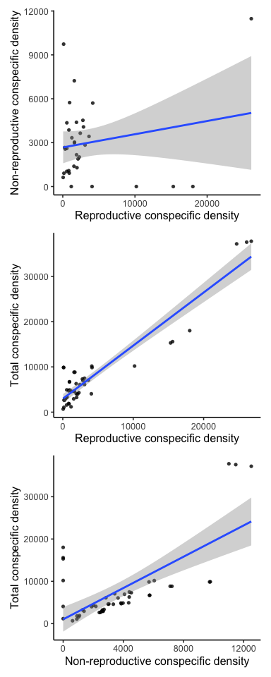

Response to reviewer \#1, comment \#1
================
eleanorjackson
07 March, 2025

> It is not clear if the variable ‘non-reproductive conspecific density’
> (first mentioned lines 164-167) refers to total conspecific density
> (i.e., reproductive + non-reproductive) or non-reproductive
> conspecific only. This first sentence makes me think that it is total
> density (“density… including non-reproductive conspecific
> individuals”), but the data presented in Figure 2 show that the values
> for non-reproductive density are lower than reproductive density
> (i.e., max ~12,000 vs ~26,000) and so the variable must be
> non-reproductive conspecific only (i.e., total – (minus)
> reproductive). These definitions should be clarified, but it also
> leads me to wonder why non-reproductive density was assessed rather
> than total density. As presented in Figure A2, non-reproductive
> density has no clear relationship to reproductive density and
> therefore tells us little about total density which is the likely
> mechanism of non-pollination resource competition (e.g., soil
> nutrients, soil moisture, light). Looking at the data presented in
> Figure A2, the two highest non-reproductive density values (top of
> graph ~10,000 and 11,500) correspond to vastly different reproductive
> density values (i.e., ~0 and 26,000). The total density values for
> these data points are therefore approximately 10,000 and 37,500,
> respectively, which is a very large difference compared to the
> non-reproductive densities of ~10,000 and 11,500, respectively. My
> concern is that total density is not captured in this analysis but
> could have large impacts on the reproductive attributes measured in
> this study. Hopefully the authors can clarify if my interpretation is
> correct and consider if an analysis using total density rather than
> non-reproductive only is more appropriate.

``` r
library("tidyverse")
```

    ## ── Attaching core tidyverse packages ──────────────────────── tidyverse 2.0.0 ──
    ## ✔ dplyr     1.1.2     ✔ readr     2.1.4
    ## ✔ forcats   1.0.0     ✔ stringr   1.5.0
    ## ✔ ggplot2   3.5.1     ✔ tibble    3.2.1
    ## ✔ lubridate 1.9.2     ✔ tidyr     1.3.0
    ## ✔ purrr     1.0.1     
    ## ── Conflicts ────────────────────────────────────────── tidyverse_conflicts() ──
    ## ✖ dplyr::filter() masks stats::filter()
    ## ✖ dplyr::lag()    masks stats::lag()
    ## ℹ Use the conflicted package (<http://conflicted.r-lib.org/>) to force all conflicts to become errors

``` r
library("here")
```

    ## here() starts at /Users/eleanorjackson/Library/CloudStorage/OneDrive-Nexus365/wytham-hawthorn

``` r
library("brms")
```

    ## Loading required package: Rcpp
    ## Loading 'brms' package (version 2.21.5). Useful instructions
    ## can be found by typing help('brms'). A more detailed introduction
    ## to the package is available through vignette('brms_overview').
    ## 
    ## Attaching package: 'brms'
    ## 
    ## The following object is masked from 'package:stats':
    ## 
    ##     ar

``` r
library("bayestestR")
library("tidybayes")
```

    ## 
    ## Attaching package: 'tidybayes'
    ## 
    ## The following object is masked from 'package:bayestestR':
    ## 
    ##     hdi
    ## 
    ## The following objects are masked from 'package:brms':
    ## 
    ##     dstudent_t, pstudent_t, qstudent_t, rstudent_t

``` r
library("ggdist")
```

    ## 
    ## Attaching package: 'ggdist'
    ## 
    ## The following object is masked from 'package:bayestestR':
    ## 
    ##     hdi
    ## 
    ## The following objects are masked from 'package:brms':
    ## 
    ##     dstudent_t, pstudent_t, qstudent_t, rstudent_t

``` r
library("ggblend")
library("patchwork")
library("viridisLite")
library("modelr")

options(brms.file_refit = "on_change")
```

``` r
readRDS(here::here("data", "clean", "fruit_set_data.rds")) %>%
  mutate(repro_connectivity_sc = scale(repro_connectivity),
         connectivity_sc = scale(connectivity),
         dbh_sc = scale(dbh),
         tree_id = as.factor(tree_id),
         year = as.factor(year)
  ) -> fruit_set_data

readRDS(here::here("data", "clean", "fruit_drop_early.rds")) %>%
  mutate(repro_connectivity_sc = scale(repro_connectivity),
         connectivity_sc = scale(connectivity),
         dbh_sc = scale(dbh),
         tree_id = as.factor(tree_id)
           ) -> early_drop_data

readRDS(here::here("data", "clean", "fruit_drop_late.rds")) %>%
  mutate(repro_connectivity_sc = scale(repro_connectivity),
         connectivity_sc = scale(connectivity),
         dbh_sc = scale(dbh),
         tree_id = as.factor(tree_id)
  ) -> late_drop_data

bprior <- c(prior(normal(0, 1), class = b))
```

## plot correlation

``` r
readRDS(here::here("data", "clean", "connectivity_data.rds")) %>%
  filter(plot %% 1 == 0) %>%  
  ggplot(aes(x = repro_connectivity, y = non_repro_connectivity)) +
  geom_point(shape = 16, alpha = 0.8) +
  geom_smooth(method = "lm") +
  labs(
       x = "Reproductive conspecific density", 
       y = "Non-reproductive conspecific density") +
  theme_classic(base_size = 12) +
  
  readRDS(here::here("data", "clean", "connectivity_data.rds")) %>%
  ggplot(aes(x = repro_connectivity, y = connectivity)) +
  geom_point(shape = 16, alpha = 0.8) +
  geom_smooth(method = "lm") +
  labs(
       x = "Reproductive conspecific density", 
       y = "Total conspecific density") +
  theme_classic(base_size = 12) +
  
  readRDS(here::here("data", "clean", "connectivity_data.rds")) %>%
  ggplot(aes(x = non_repro_connectivity, y = connectivity)) +
  geom_point(shape = 16, alpha = 0.8) +
  geom_smooth(method = "lm") +
  labs(
       x = "Non-reproductive conspecific density", 
       y = "Total conspecific density") +
  theme_classic(base_size = 12) +
  
  plot_layout(ncol = 1)
```

    ## `geom_smooth()` using formula = 'y ~ x'
    ## `geom_smooth()` using formula = 'y ~ x'
    ## `geom_smooth()` using formula = 'y ~ x'

<!-- -->

## Fit models with total connectivity + reproductive connectivity

``` r
fruit_set_mod <-
  brm(data = fruit_set_data,
      family = binomial(link = logit),
      n_immature_fruits | trials(n_flowers) ~
        repro_connectivity_sc +
        connectivity_sc +
        dbh_sc + year + (1|tree_id),
      prior = bprior,
      iter = 2000,
      warmup = 1000,
      chains = 4,
      cores = 4,
      seed = 9,
      file = (here::here(
        "code",
        "exploration", 
        "figures",
        "2025-02-20_revisions-total-connectivity", 
        "fruit_set_fit.rds")))

summary(fruit_set_mod)
```

    ##  Family: binomial 
    ##   Links: mu = logit 
    ## Formula: n_immature_fruits | trials(n_flowers) ~ repro_connectivity_sc + connectivity_sc + dbh_sc + year + (1 | tree_id) 
    ##    Data: fruit_set_data (Number of observations: 143) 
    ##   Draws: 4 chains, each with iter = 2000; warmup = 1000; thin = 1;
    ##          total post-warmup draws = 4000
    ## 
    ## Multilevel Hyperparameters:
    ## ~tree_id (Number of levels: 34) 
    ##               Estimate Est.Error l-95% CI u-95% CI Rhat Bulk_ESS Tail_ESS
    ## sd(Intercept)     0.58      0.08     0.44     0.76 1.00      899     1553
    ## 
    ## Regression Coefficients:
    ##                       Estimate Est.Error l-95% CI u-95% CI Rhat Bulk_ESS
    ## Intercept                -0.44      0.11    -0.65    -0.23 1.00      697
    ## repro_connectivity_sc    -0.42      0.22    -0.85     0.01 1.01      967
    ## connectivity_sc           0.44      0.22    -0.00     0.88 1.00      961
    ## dbh_sc                    0.08      0.11    -0.14     0.30 1.00      768
    ## year2023                 -0.80      0.04    -0.89    -0.71 1.00     3045
    ##                       Tail_ESS
    ## Intercept                 1356
    ## repro_connectivity_sc     1482
    ## connectivity_sc           1485
    ## dbh_sc                    1133
    ## year2023                  2587
    ## 
    ## Draws were sampled using sampling(NUTS). For each parameter, Bulk_ESS
    ## and Tail_ESS are effective sample size measures, and Rhat is the potential
    ## scale reduction factor on split chains (at convergence, Rhat = 1).

``` r
early_drop_mod <-
  brm(data = early_drop_data,
      family = binomial(link = logit),
      n_dropped | trials(total_fruit) ~
        repro_connectivity_sc +
        connectivity_sc +
        dbh_sc + (1|tree_id),
      prior = bprior,
      iter = 2000,
      warmup = 1000,
      chains = 4,
      cores = 4,
      seed = 9,
      file = (here::here("code",
        "exploration", 
        "figures",
        "2025-02-20_revisions-total-connectivity",
        "early_drop_fit.rds")))

summary(early_drop_mod)
```

    ##  Family: binomial 
    ##   Links: mu = logit 
    ## Formula: n_dropped | trials(total_fruit) ~ repro_connectivity_sc + connectivity_sc + dbh_sc + (1 | tree_id) 
    ##    Data: early_drop_data (Number of observations: 104) 
    ##   Draws: 4 chains, each with iter = 2000; warmup = 1000; thin = 1;
    ##          total post-warmup draws = 4000
    ## 
    ## Multilevel Hyperparameters:
    ## ~tree_id (Number of levels: 33) 
    ##               Estimate Est.Error l-95% CI u-95% CI Rhat Bulk_ESS Tail_ESS
    ## sd(Intercept)     0.66      0.11     0.48     0.90 1.01     1038     1946
    ## 
    ## Regression Coefficients:
    ##                       Estimate Est.Error l-95% CI u-95% CI Rhat Bulk_ESS
    ## Intercept                -1.18      0.13    -1.43    -0.93 1.00     1165
    ## repro_connectivity_sc     0.05      0.30    -0.53     0.63 1.00     1161
    ## connectivity_sc           0.37      0.29    -0.20     0.95 1.00     1227
    ## dbh_sc                    0.19      0.13    -0.06     0.43 1.00     1033
    ##                       Tail_ESS
    ## Intercept                 1633
    ## repro_connectivity_sc     1431
    ## connectivity_sc           1601
    ## dbh_sc                    1716
    ## 
    ## Draws were sampled using sampling(NUTS). For each parameter, Bulk_ESS
    ## and Tail_ESS are effective sample size measures, and Rhat is the potential
    ## scale reduction factor on split chains (at convergence, Rhat = 1).

``` r
late_drop_mod <-
  brm(data = late_drop_data,
      family = binomial(link = logit),
      n_dropped | trials(total_fruit) ~
        repro_connectivity_sc +
        connectivity_sc +
        dbh_sc + (1|tree_id),
      prior = bprior,
      iter = 2000,
      warmup = 1000,
      chains = 4,
      cores = 4,
      seed = 9,
      file = (here::here("code",
        "exploration", 
        "figures",
        "2025-02-20_revisions-total-connectivity",
        "late_drop_fit.rds")))

summary(late_drop_mod)
```

    ##  Family: binomial 
    ##   Links: mu = logit 
    ## Formula: n_dropped | trials(total_fruit) ~ repro_connectivity_sc + connectivity_sc + dbh_sc + (1 | tree_id) 
    ##    Data: late_drop_data (Number of observations: 96) 
    ##   Draws: 4 chains, each with iter = 2000; warmup = 1000; thin = 1;
    ##          total post-warmup draws = 4000
    ## 
    ## Multilevel Hyperparameters:
    ## ~tree_id (Number of levels: 32) 
    ##               Estimate Est.Error l-95% CI u-95% CI Rhat Bulk_ESS Tail_ESS
    ## sd(Intercept)     0.88      0.14     0.64     1.22 1.00      834     1169
    ## 
    ## Regression Coefficients:
    ##                       Estimate Est.Error l-95% CI u-95% CI Rhat Bulk_ESS
    ## Intercept                -1.38      0.16    -1.69    -1.07 1.01      634
    ## repro_connectivity_sc     0.64      0.35    -0.05     1.31 1.00     1030
    ## connectivity_sc          -0.29      0.36    -0.97     0.44 1.00     1035
    ## dbh_sc                    0.29      0.17    -0.05     0.64 1.01      873
    ##                       Tail_ESS
    ## Intercept                 1443
    ## repro_connectivity_sc     1736
    ## connectivity_sc           1655
    ## dbh_sc                    1401
    ## 
    ## Draws were sampled using sampling(NUTS). For each parameter, Bulk_ESS
    ## and Tail_ESS are effective sample size measures, and Rhat is the potential
    ## scale reduction factor on split chains (at convergence, Rhat = 1).

``` r
font_size <- 23
pal <- viridisLite::viridis(n = 3, begin = 0.2, end = 0.8, option = "mako")
names(pal) <- c("2021", "2022", "2023")
dens_col <- "lightgrey"
```

``` r
tidybayes::tidy_draws(fruit_set_mod) %>%
  rename(
    `Diameter at\nbreast height` = b_dbh_sc,
    `Reproductive\nconspecific density` = b_repro_connectivity_sc,
    `Total\nconspecific density` = b_connectivity_sc,
    `Year` = `b_year2023`
  ) %>%
  select(
    `Reproductive\nconspecific density`,
    `Total\nconspecific density`,
    `Diameter at\nbreast height`,
    `Year`
  ) %>%
  pivot_longer(cols = everything(), names_to = "parameter") %>%
  ggplot(aes(x = value,
             y = factor(
               parameter,
               levels = c(
                 "Year",
                 "Diameter at\nbreast height",
                 "Total\nconspecific density",
                 "Reproductive\nconspecific density"
               )
             ))) +
  ggdist::stat_halfeye(
    aes(slab_alpha = after_stat(-pmax(abs(
      1 - 2 * cdf
    ), .95))),
    fill_type = "gradient",
    stroke = 2,
    size = 12,
    linewidth = 10,
    shape = 21,
    point_fill = "white", slab_fill = dens_col,
  ) +
  scale_slab_alpha_continuous(guide = "none") +
  theme_classic(base_size = font_size) +
  geom_vline(xintercept = 0,
             linetype = 2,
             linewidth = 1) +
  labs(x = "Parameter value", y = "") +
  theme(
    legend.position = "none",
    plot.margin = margin(
      t = 0.1,
      r = 0.7,
      b = 0.1,
      l = 0,
      "in"
    ),
    axis.text.y = element_text(colour = "black")
  ) -> pa
```

``` r
tidybayes::tidy_draws(early_drop_mod) %>%
  rename(
    `Diameter at\nbreast height` = b_dbh_sc,
    `Reproductive\nconspecific density` = b_repro_connectivity_sc,
    `Total\nconspecific density` = b_connectivity_sc
  ) %>%
  select(
    `Reproductive\nconspecific density`,
    `Total\nconspecific density`,
    `Diameter at\nbreast height`
  ) %>%
  pivot_longer(cols = everything(), names_to = "parameter") %>%
  ggplot(aes(x = value,
             y = factor(
               parameter,
               levels = c(
                 "Diameter at\nbreast height",
                 "Total\nconspecific density",
                 "Reproductive\nconspecific density"
               )
             ))) +
  ggdist::stat_halfeye(
    aes(slab_alpha = after_stat(-pmax(abs(
      1 - 2 * cdf
    ), .95))),
    fill_type = "gradient",
    stroke = 2,
    size = 12,
    linewidth = 10,
    shape = 21,
    point_fill = "white",
    slab_fill = dens_col,
  ) +
  scale_slab_alpha_continuous(guide = "none") +
  theme_classic(base_size = font_size) +
  geom_vline(xintercept = 0,
             linetype = 2,
             linewidth = 1) +
  labs(x = "Parameter value", y = "") +
  theme(
    legend.position = "none",
    plot.margin = margin(
      t = 0.1,
      r = 0.7,
      b = 0.1,
      l = 0,
      "in"
    ),
    axis.text.y = element_text(colour = "black")
  ) -> pe
```

``` r
tidybayes::tidy_draws(late_drop_mod) %>%
  rename(
    `Diameter at\nbreast height` = b_dbh_sc,
    `Reproductive\nconspecific density` = b_repro_connectivity_sc,
    `Total\nconspecific density` = b_connectivity_sc
  ) %>%
  select(
    `Reproductive\nconspecific density`,
    `Total\nconspecific density`,
    `Diameter at\nbreast height`
  ) %>%
  pivot_longer(cols = everything(), names_to = "parameter") %>%
  ggplot(aes(x = value,
             y = factor(
               parameter,
               levels = c(
                 "Diameter at\nbreast height",
                 "Total\nconspecific density",
                 "Reproductive\nconspecific density"
               )
             ))) +
  ggdist::stat_halfeye(
    aes(slab_alpha = after_stat(-pmax(abs(
      1 - 2 * cdf
    ), .95))),
    fill_type = "gradient",
    stroke = 2,
    size = 12,
    linewidth = 10,
    shape = 21,
    point_fill = "white",
    slab_fill = dens_col,
  ) +
  scale_slab_alpha_continuous(guide = "none") +
  theme_classic(base_size = font_size) +
  geom_vline(xintercept = 0,
             linetype = 2,
             linewidth = 1) +
  labs(x = "Parameter value", y = "") +
  theme(
    legend.position = "none",
    plot.margin = margin(
      t = 0.1,
      r = 0.7,
      b = 0.1,
      l = 0,
      "in"
    ),
    axis.text.y = element_text(colour = "black")
  ) -> pi
```

``` r
comb <- pa + pe + pi + 
  patchwork::plot_annotation(tag_levels = "a") 


png(
  here::here("code", 
             "exploration", 
             "figures", 
             "2025-02-20_revisions-total-connectivity",
             "total-connectivity-posterior-draws.png"),
  width = 1476,
  height = 500,
  units = "px",
  type = "cairo"
)
comb
dev.off()
```

    ## quartz_off_screen 
    ##                 2
